<table style="width:100%; border:none; margin-bottom:20px;">
<tr>
<td width="120" align="center" style="border:none;">

</td>
<td align="right" style="border:none; padding: 20px 10px;">
<h1 style="color:#c2185b; font-family: Georgia, serif; letter-spacing: 2px; margin-bottom:5px;">EL ÁRBOL DE HIGOS</h1>
<p style="color:#ad1457; font-style: italic; font-size: 15px; margin:0;">Semana 01 — Primera página web con PHP</p>
<p style="color:#e91e8c; font-size: 13px; margin:0;">Desarrollo de Aplicaciones Web</p>
</td>
</tr>
</table>

<table style="width:100%; border-collapse: collapse;">
<tr style="background-color:#c2185b; color:#ffffff;">
<td style="padding:8px;"><b>Alumna</b></td>
<td style="padding:8px;">Patricia Segura Resendiz</td>
</tr>
<tr style="background-color:#fce4ec;">
<td style="padding:8px;"><b>Institución</b></td>
<td style="padding:8px;">Instituto Tecnológico Superior de Rioverde</td>
</tr>
<tr style="background-color:#c2185b; color:#ffffff;">
<td style="padding:8px;"><b>Carrera</b></td>
<td style="padding:8px;">Ingeniería en Sistemas Computacionales</td>
</tr>
<tr style="background-color:#fce4ec;">
<td style="padding:8px;"><b>Docente</b></td>
<td style="padding:8px;">Ing. José de Jesús Collazo Reyes</td>
</tr>
<tr style="background-color:#c2185b; color:#ffffff;">
<td style="padding:8px;"><b>Entorno</b></td>
<td style="padding:8px;">WampServer · Apache 2.4.59 · PHP 8.2.18</td>
</tr>
</table>

<br>

<h2 style="color:#c2185b; border-bottom: 3px solid #f48fb1; padding-bottom: 6px;">Aplicación web</h2>

<blockquote style="border-left: 4px solid #f48fb1; background:#fff0f5; padding: 10px 15px; color:#333;">
Una aplicación web es un programa al que se accede mediante un navegador. En mi caso, construí una pequeña tienda de libros llamada "El Árbol de Higos", donde se muestra información de un libro (autora, título, precio, cantidad y total) generada mediante PHP.
</blockquote>

<br>

<h2 style="color:#c2185b; border-bottom: 3px solid #f48fb1; padding-bottom: 6px;">Cliente y servidor</h2>

<blockquote style="border-left: 4px solid #f48fb1; background:#fff0f5; padding: 10px 15px; color:#333;">
El cliente es quien pide o solicita algo. En mi práctica, el cliente fue mi navegador (Chrome): cada vez que entraba a <code>localhost:8000</code> o recargaba la página, el navegador le pedía la página al servidor.
<br><br>
El servidor es el programa que recibe esa petición y responde con lo que se le pide. En mi caso, fue el servidor de desarrollo de PHP corriendo en mi computadora con el comando <code>php -S localhost:8000</code>.
</blockquote>

<br>

<h2 style="color:#c2185b; border-bottom: 3px solid #f48fb1; padding-bottom: 6px;">HTTP</h2>

<blockquote style="border-left: 4px solid #f48fb1; background:#fff0f5; padding: 10px 15px; color:#333;">
HTTP es el protocolo, es decir las reglas, que usan el navegador y el servidor para comunicarse. Gracias a HTTP, cuando pedí la página, el servidor supo cómo responderme correctamente, con el código de estado <code>200 OK</code> que comprobé en la pestaña Network de las herramientas de desarrollador.
</blockquote>

<br>

<h2 style="color:#c2185b; border-bottom: 3px solid #f48fb1; padding-bottom: 6px;">PHP</h2>

<blockquote style="border-left: 4px solid #f48fb1; background:#fff0f5; padding: 10px 15px; color:#333;">
PHP es un lenguaje de programación que se ejecuta del lado del servidor, nunca en el navegador. Lo comprobé en mi experimento: al revisar la respuesta en las herramientas de desarrollador, no vi ninguna línea de código PHP, solo vi el resultado ya convertido en HTML.
</blockquote>

<div align="center">

<p style="color:#c2185b; font-style:italic; font-size:13px;">Verificación de la versión de PHP desde Git Bash</p>
</div>

<br>

<h2 style="color:#c2185b; border-bottom: 3px solid #f48fb1; padding-bottom: 6px;">HTML</h2>

<blockquote style="border-left: 4px solid #f48fb1; background:#fff0f5; padding: 10px 15px; color:#333;">
HTML es el lenguaje que le da estructura a la página: títulos, párrafos, negritas, etc. Es lo único que el navegador entiende y puede mostrar; por eso PHP siempre termina generando HTML antes de enviarlo al navegador.
</blockquote>

<br>

<h2 style="color:#c2185b; border-bottom: 3px solid #f48fb1; padding-bottom: 6px;">localhost</h2>

<blockquote style="border-left: 4px solid #f48fb1; background:#fff0f5; padding: 10px 15px; color:#333;">
<code>localhost</code> significa "esta misma computadora". Cuando entro a <code>http://localhost:8000</code>, le estoy diciendo al navegador que busque el servidor que está corriendo en mi propia máquina, sin salir a internet.
</blockquote>

<div align="center">
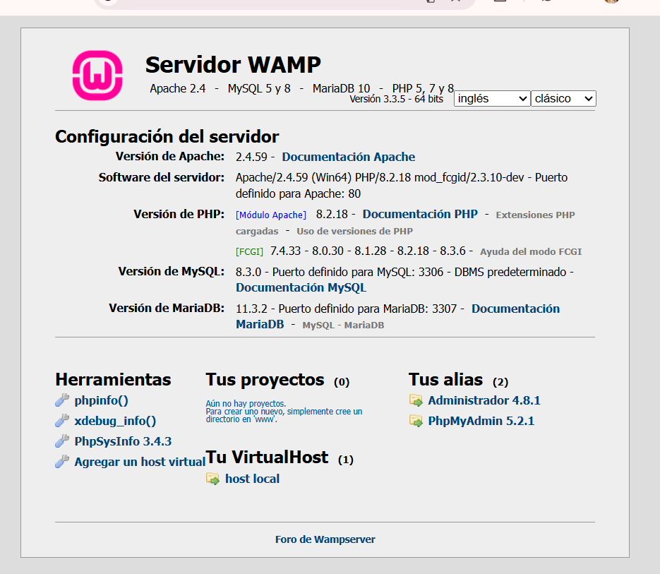
<p style="color:#c2185b; font-style:italic; font-size:13px;">Panel de WampServer activo</p>
</div>

<br>

<h2 style="color:#c2185b; border-bottom: 3px solid #f48fb1; padding-bottom: 6px;">Variables y tipos de datos</h2>

<table style="width:100%; border-collapse: collapse;">
<tr style="background-color:#c2185b; color:#ffffff;">
<th style="padding:8px; text-align:left;">Variable</th>
<th style="padding:8px; text-align:left;">Tipo</th>
<th style="padding:8px; text-align:left;">Valor</th>
</tr>
<tr style="background-color:#fce4ec;">
<td style="padding:8px;"><code>$autor</code></td><td style="padding:8px;">string</td><td style="padding:8px;">"Sylvia Plath"</td>
</tr>
<tr style="background-color:#ffffff;">
<td style="padding:8px;"><code>$libro</code></td><td style="padding:8px;">string</td><td style="padding:8px;">"The Bell Jar"</td>
</tr>
<tr style="background-color:#fce4ec;">
<td style="padding:8px;"><code>$precio</code></td><td style="padding:8px;">float</td><td style="padding:8px;">250.50</td>
</tr>
<tr style="background-color:#ffffff;">
<td style="padding:8px;"><code>$cantidad</code></td><td style="padding:8px;">integer</td><td style="padding:8px;">2</td>
</tr>
<tr style="background-color:#fce4ec;">
<td style="padding:8px;"><code>$disponible</code></td><td style="padding:8px;">boolean</td><td style="padding:8px;">true</td>
</tr>
<tr style="background-color:#ffffff;">
<td style="padding:8px;"><code>$total</code></td><td style="padding:8px;">float (calculado)</td><td style="padding:8px;">501</td>
</tr>
</table>

<blockquote style="border-left: 4px solid #f48fb1; background:#fff0f5; padding: 10px 15px; color:#333; margin-top:10px;">
Una variable es un espacio donde guardo un dato para usarlo después en el programa. Utilicé cuatro tipos de datos: string (texto, como <code>$autor</code>), integer (números enteros, como <code>$cantidad</code>), float (números con decimales, como <code>$precio</code>) y boolean (verdadero o falso, como <code>$disponible</code>). Comprobé que si cambio el valor de una variable, el resultado de la página cambia automáticamente.
</blockquote>

<br>

<h2 style="color:#c2185b; border-bottom: 3px solid #f48fb1; padding-bottom: 6px;">Operadores</h2>

```php
$total = $precio * $cantidad;
```

<p style="background:#fff0f5; border-left:4px solid #f48fb1; padding:10px 15px; font-weight:bold; color:#c2185b;">250.50 × 2 = 501</p>

<blockquote style="border-left: 4px solid #f48fb1; background:#fff0f5; padding: 10px 15px; color:#333;">
Los operadores son símbolos que permiten hacer operaciones con los datos. Usé el operador de multiplicación (<code>*</code>) para calcular el total, y también probé el operador de suma (<code>+</code>) en una de mis pruebas para ver cómo cambiaba el resultado.
</blockquote>

<br>

<h2 style="color:#c2185b; border-bottom: 3px solid #f48fb1; padding-bottom: 6px;">PHP + HTML</h2>

<blockquote style="border-left: 4px solid #f48fb1; background:#fff0f5; padding: 10px 15px; color:#333;">
Integré PHP dentro del HTML usando las etiquetas <code>&lt;?php ?&gt;</code>. Dentro de ese bloque declaré mis variables y usé <code>echo</code> para imprimir la información directamente entre las etiquetas HTML como <code>&lt;p&gt;</code> y <code>&lt;strong&gt;</code>, de modo que el resultado final se viera integrado dentro de la estructura de la página.
</blockquote>

<div align="center">
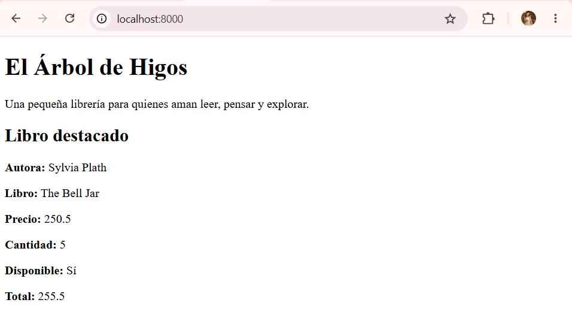
<p style="color:#c2185b; font-style:italic; font-size:13px;">Página funcionando en localhost:8000</p>
</div>

<br>

<h2 style="color:#c2185b; border-bottom: 3px solid #f48fb1; padding-bottom: 6px;">Experimento con herramientas de desarrollador</h2>

<blockquote style="border-left: 4px solid #f48fb1; background:#fff0f5; padding: 10px 15px; color:#333;">
<b>¿Qué archivo solicitó el navegador?</b><br>
El navegador pidió <code>http://localhost:8000/</code>. Como no puse ningún archivo específico en la URL, el servidor buscó por defecto el archivo <code>index.php</code> y lo ejecutó.
<br><br>
<b>¿Qué código de respuesta recibió?</b><br>
Recibí el código <code>200 OK</code>, que significa que la petición se hizo correctamente y el servidor pudo entregar la página sin ningún problema.
<br><br>
<b>¿Qué contenido recibió?</b><br>
El navegador recibió puro HTML: etiquetas como <code>&lt;h1&gt;</code>, <code>&lt;p&gt;</code>, <code>&lt;strong&gt;</code>, con la información ya lista (Sylvia Plath, The Bell Jar, 250.5, 2, Sí, 501). No recibió código PHP.
<br><br>
<b>¿Puedes encontrar literalmente el código PHP que escribiste?</b><br>
No. En la pestaña Response no aparece en ningún lado <code>&lt;?php</code>, <code>echo</code> ni <code>$autor</code>. Solo se ve el resultado final ya convertido en HTML.
<br><br>
<b>¿Por qué?</b><br>
Porque PHP se ejecuta en el servidor, no en el navegador. Antes de enviar la respuesta, el servidor procesa todo el código PHP y lo convierte en HTML normal. El navegador solo entiende HTML, CSS y JavaScript, por eso nunca ve el código PHP original, solo ve lo que ese código generó.
</blockquote>

<div align="center">
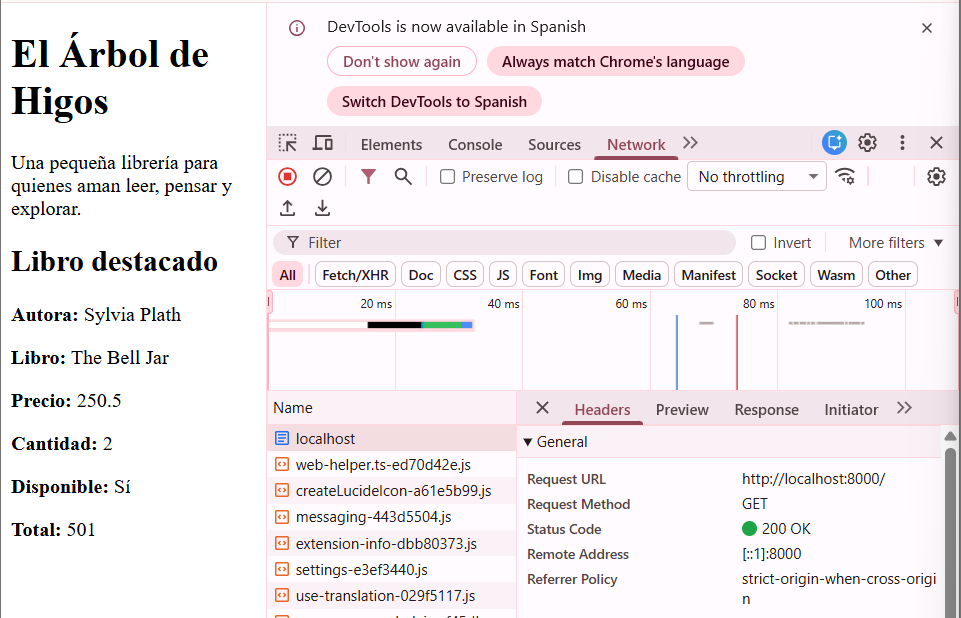
<p style="color:#c2185b; font-style:italic; font-size:13px;">Pestaña Network — código de estado 200 OK</p>
<br>
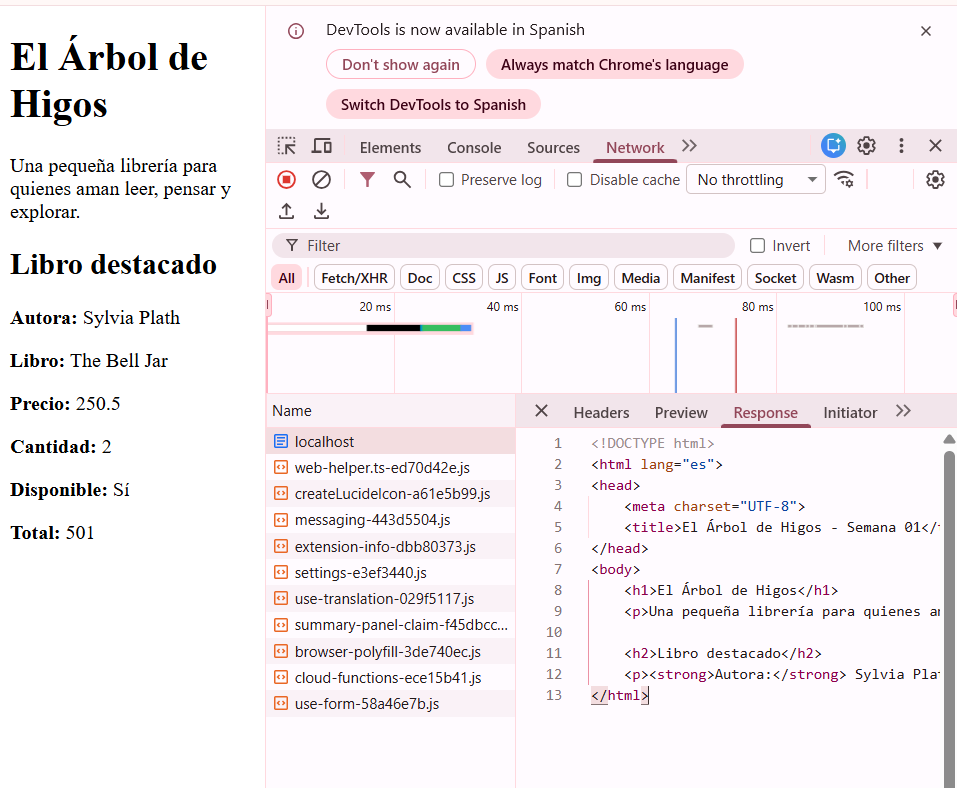
<p style="color:#c2185b; font-style:italic; font-size:13px;">Pestaña Response — HTML recibido, sin código PHP</p>
</div>

<br>

<h2 style="color:#c2185b; border-bottom: 3px solid #f48fb1; padding-bottom: 6px;">Pruebas realizadas</h2>

<blockquote style="border-left: 4px solid #f48fb1; background:#fff0f5; padding: 10px 15px; color:#333;">
<b>Prueba 1 — Modificación de datos</b><br>
Cambié el valor de la variable <code>$cantidad</code> de 2 a 5. Al recargar, la Cantidad se actualizó a 5 y el Total cambió de 501 a 1252.5, porque esa variable se usa dentro de la operación <code>$total = $precio * $cantidad</code>.
<br><br>
<b>Prueba 2 — Modificación de una operación</b><br>
Cambié el operador de multiplicación (<code>*</code>) por el de suma (<code>+</code>). El resultado cambió de 1252.5 a 255.5. Esto me mostró que la operación matemática afecta directamente el resultado final.
<br><br>
<b>Prueba 3 — Nueva variable</b><br>
Agregué la variable <code>$paginas = 244;</code> y la mostré con un <code>echo</code> adicional. Apareció correctamente "Páginas: 244" en la página.
<br><br>
<b>Prueba 4 — Eliminación de código</b><br>
Comenté la línea que mostraba el Total usando <code>//</code>. La línea desapareció de la página, pero el resto siguió funcionando con normalidad, sin ningún error.
<br><br>
<b>Prueba 5 — Error de sintaxis</b><br>
Quité el punto y coma al final de <code>$paginas = 244;</code>. Al recargar apareció el error: <code>Parse error: syntax error, unexpected token "echo" in ...index.php on line 22</code>. Después restauré el punto y coma y la página volvió a funcionar con normalidad.
</blockquote>

<div align="center">
<table style="width:100%;">
<tr>
<td align="center" width="33%">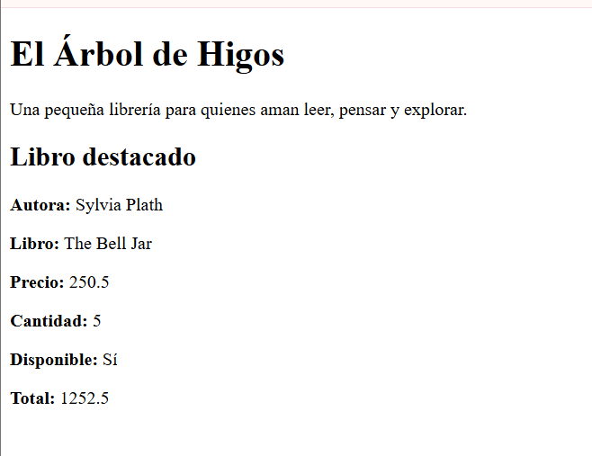<p style="font-size:12px; color:#c2185b;">Prueba 1 — Cantidad 5</p></td>
<td align="center" width="33%">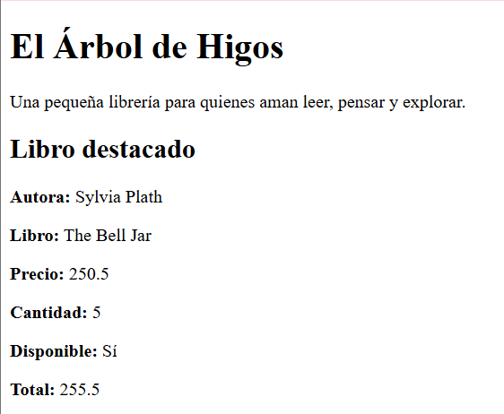<p style="font-size:12px; color:#c2185b;">Prueba 2 — Operador cambiado</p></td>
<td align="center" width="33%">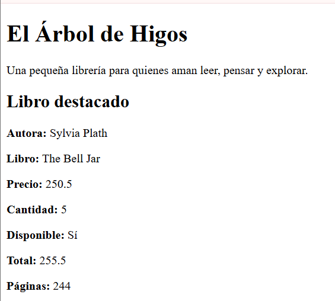<p style="font-size:12px; color:#c2185b;">Prueba 3 — Nueva variable</p></td>
</tr>
</table>

<table style="width:100%; margin-top:10px;">
<tr>
<td align="center" width="50%">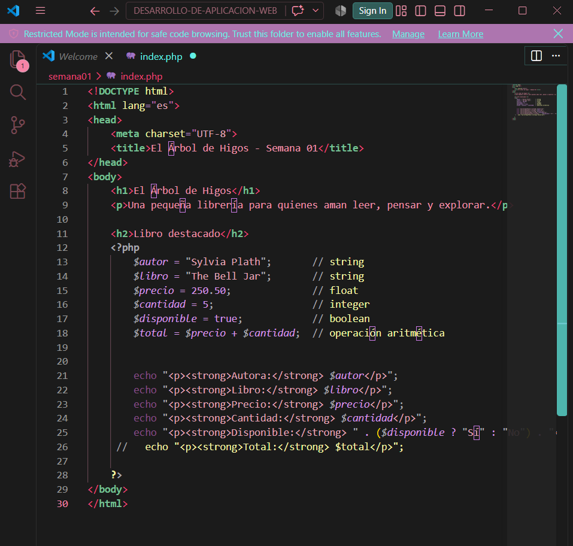<p style="font-size:12px; color:#c2185b;">Prueba 4 — Código comentado</p></td>
<td align="center" width="50%">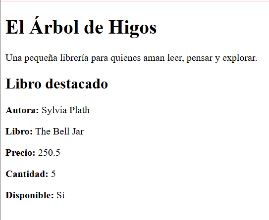<p style="font-size:12px; color:#c2185b;">Prueba 4 — Página sin Total</p></td>
</tr>
</table>

<table style="width:100%; margin-top:10px;">
<tr>
<td align="center" width="50%">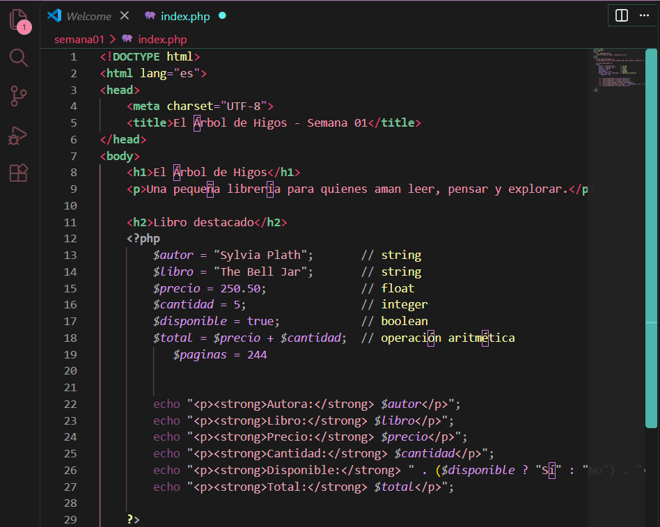<p style="font-size:12px; color:#a33a2e;">Prueba 5 — Código con error</p></td>
<td align="center" width="50%">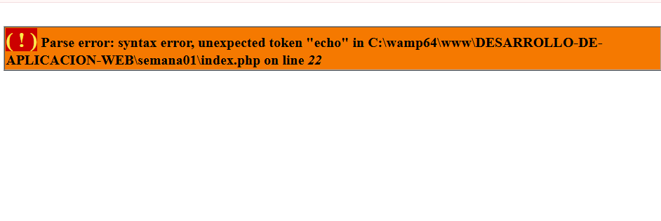<p style="font-size:12px; color:#a33a2e;">Prueba 5 — Error en el navegador</p></td>
</tr>
<tr>
<td align="center" width="50%">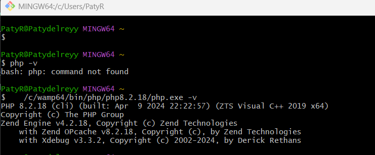<p style="font-size:12px; color:#2e7d32;">Prueba 5 — Código corregido</p></td>
<td align="center" width="50%"><p style="font-size:12px; color:#2e7d32;">Prueba 5 — Página funcionando de nuevo</p></td>
</tr>
</table>
</div>

<br>

<h2 style="color:#c2185b; border-bottom: 3px solid #f48fb1; padding-bottom: 6px;">Problemas encontrados</h2>

<table style="width:100%; border-collapse: collapse;">
<tr style="background-color:#fce4ec;"><td style="padding:8px;"><b>Qué ocurrió</b></td><td style="padding:8px;">El navegador mostró "ERR_CONNECTION_REFUSED" al recargar la página.</td></tr>
<tr style="background-color:#ffffff;"><td style="padding:8px;"><b>Causa</b></td><td style="padding:8px;">El servidor PHP se detuvo al hacer clic dentro de la terminal de Git Bash, activando el modo de selección de texto de Windows.</td></tr>
<tr style="background-color:#fce4ec;"><td style="padding:8px;"><b>Investigación</b></td><td style="padding:8px;">Revisé si el servidor seguía corriendo en la terminal y noté que había regresado al prompt normal.</td></tr>
<tr style="background-color:#ffffff;"><td style="padding:8px;"><b>Prueba realizada</b></td><td style="padding:8px;">Volví a ejecutar el comando para levantar el servidor.</td></tr>
</table>

<table style="width:100%; margin-top:10px;">
<tr>
<td align="center" width="50%">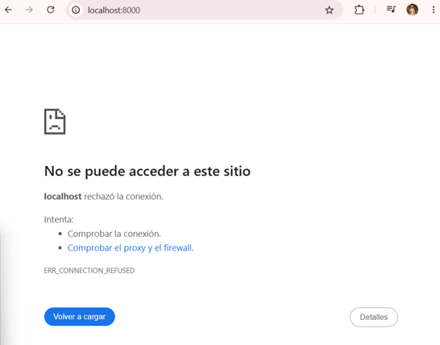<p style="color:#a33a2e; font-style:italic; font-size:13px;">Antes — Error de conexión</p></td>
<td align="center" width="50%">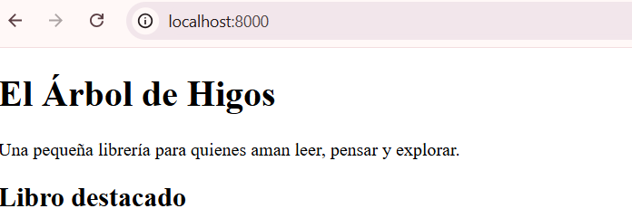<p style="color:#2e7d32; font-style:italic; font-size:13px;">Después — Servidor restaurado</p></td>
</tr>
</table>

<br>

<h2 style="color:#c2185b; border-bottom: 3px solid #f48fb1; padding-bottom: 6px;">Soluciones aplicadas</h2>

<blockquote style="border-left: 4px solid #f48fb1; background:#fff0f5; padding: 10px 15px; color:#333;">
Para el error de conexión, volví a levantar el servidor con el mismo comando y aprendí a usar una segunda ventana de Git Bash exclusiva para los comandos de Git, sin tocar la terminal donde corre el servidor.
<br><br>
Para el error de sintaxis, identifiqué que faltaba un punto y coma al final de una instrucción y lo agregué de nuevo, lo que restauró el funcionamiento normal de la página.
</blockquote>

<br>

<h2 style="color:#c2185b; border-bottom: 3px solid #f48fb1; padding-bottom: 6px;">¿Qué recibe el navegador?</h2>

<blockquote style="border-left: 4px solid #f48fb1; background:#fff0f5; padding: 10px 15px; color:#333;">
El navegador recibe solo HTML puro, con la información ya resuelta (por ejemplo, ve "Total: 501" en vez de la fórmula <code>$precio * $cantidad</code>). Todo el trabajo de PHP ya se hizo antes de que la respuesta llegara al navegador, porque el navegador solo sabe interpretar HTML, CSS y JavaScript.
</blockquote>

<br>

<h2 style="color:#c2185b; border-bottom: 3px solid #f48fb1; padding-bottom: 6px;">Reflexión final</h2>

<blockquote style="border-left: 4px solid #f48fb1; background:#fff0f5; padding: 10px 15px; color:#333;">
Desde que escribo <code>http://localhost:8000</code> en el navegador, este envía una solicitud HTTP al servidor que tengo corriendo en mi propia computadora. El servidor recibe esa solicitud, busca el archivo <code>index.php</code>, y PHP procesa todo el código: crea las variables, hace los cálculos y genera el HTML final. Ese HTML es lo único que regresa al navegador, y por eso, aunque yo escribí código PHP, nunca lo veo directamente en pantalla ni en el código fuente: solo veo el resultado. Esta práctica me ayudó a entender que una página web no aparece "mágicamente", sino que es el resultado de una comunicación constante entre cliente y servidor.
</blockquote>

<br>

<h2 style="color:#c2185b; border-bottom: 3px solid #f48fb1; padding-bottom: 6px;">Historial de commits</h2>

<table style="width:100%; border-collapse: collapse;">
<tr style="background-color:#c2185b; color:#ffffff;"><th style="padding:8px;">#</th><th style="padding:8px; text-align:left;">Commit</th></tr>
<tr style="background-color:#fce4ec;"><td style="padding:8px; text-align:center;">1</td><td style="padding:8px;"><code>Crear primera pagina web con PHP</code></td></tr>
<tr style="background-color:#ffffff;"><td style="padding:8px; text-align:center;">2</td><td style="padding:8px;"><code>Agregar variables en PHP</code></td></tr>
<tr style="background-color:#fce4ec;"><td style="padding:8px; text-align:center;">3</td><td style="padding:8px;"><code>Agregar tipos de datos en PHP</code></td></tr>
<tr style="background-color:#ffffff;"><td style="padding:8px; text-align:center;">4</td><td style="padding:8px;"><code>Agregar operaciones aritmeticas</code></td></tr>
<tr style="background-color:#fce4ec;"><td style="padding:8px; text-align:center;">5</td><td style="padding:8px;"><code>Crear primera version de la tienda de libros</code></td></tr>
<tr style="background-color:#ffffff;"><td style="padding:8px; text-align:center;">6</td><td style="padding:8px;"><code>Organizar evidencia de semana 01</code></td></tr>
</table>

<div align="center" style="margin-top:15px;">
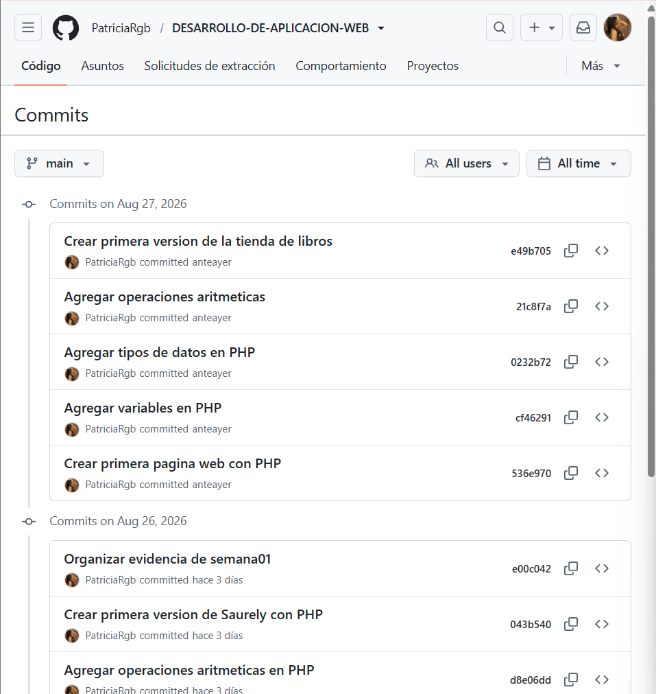
<p style="color:#c2185b; font-style:italic; font-size:13px;">Commits reflejados en GitHub</p>
</div>

<br>
