<h1 align="center" style="color:#c2185b; font-family: Georgia, serif; letter-spacing: 2px;">💐💐EL ÁRBOL DE HIGOS💐💐</h1>
<p align="center" style="color:#ad1457; font-style: italic; font-size: 15px;">Semana 02 — Formularios: el usuario interactúa</p>
<p align="center" style="color:#e91e8c; font-size: 13px;">Desarrollo de Aplicaciones Web</p>

<br>

<table style="width:100%; border-collapse: collapse;">
<tr style="background-color:#c2185b; color:#ffffff;">
<td style="padding:8px;"><b>Alumna</b></td>
<td style="padding:8px;">Patricia Segura Resendiz</td>
</tr>
<tr style="background-color:#fce4ec;">
<td style="padding:8px;"><b>Institución</b></td>
<td style="padding:8px;">Instituto Tecnológico Superior de Rioverde</td>
</tr>
<tr style="background-color:#c2185b; color:#ffffff;">
<td style="padding:8px;"><b>Carrera</b></td>
<td style="padding:8px;">Ingeniería en Sistemas Computacionales</td>
</tr>
<tr style="background-color:#fce4ec;">
<td style="padding:8px;"><b>Docente</b></td>
<td style="padding:8px;">Ing. José de Jesús Collazo Reyes</td>
</tr>
<tr style="background-color:#c2185b; color:#ffffff;">
<td style="padding:8px;"><b>Entorno</b></td>
<td style="padding:8px;">WampServer · Apache 2.4.59 · PHP 8.2.18</td>
</tr>
</table>

<br>

<h2 style="color:#c2185b; border-bottom: 3px solid #f48fb1; padding-bottom: 6px;">💐💐🌸🌸🌸💐💐 Objetivo</h2>

<blockquote style="border-left: 4px solid #f48fb1; background:#fff0f5; padding: 10px 15px; color:#333;">
Aprendí a crear formularios HTML para que el usuario pueda capturar información, a enviar esa información mediante los métodos GET y POST, a recibirla en PHP usando <code>$_GET</code> y <code>$_POST</code>, a validar los datos recibidos, y a mostrar mensajes de error o de confirmación según corresponda. También comprendí, con evidencia real de las herramientas de desarrollador, la diferencia entre ambos métodos de envío.
</blockquote>

<br>

<h2 style="color:#c2185b; border-bottom: 3px solid #f48fb1; padding-bottom: 6px;">🌸🌸🌷🌸🌸💐 Aplicación web</h2>

<blockquote style="border-left: 4px solid #f48fb1; background:#fff0f5; padding: 10px 15px; color:#333;">
Esta semana convertí mi tienda de libros "El Árbol de Higos" en una aplicación con la que el usuario puede interactuar: agregué un formulario de reseñas, donde cualquier lector puede escribir su opinión sobre un libro, calificarlo, y enviar esa información para que PHP la reciba y procese.
</blockquote>

<br>

<h2 style="color:#c2185b; border-bottom: 3px solid #f48fb1; padding-bottom: 6px;">🌸🌸💗🌸🌸💐 Formulario HTML</h2>

<blockquote style="border-left: 4px solid #f48fb1; background:#fff0f5; padding: 10px 15px; color:#333;">
Un formulario HTML es un elemento que permite al usuario capturar información (texto, números, correos, etc.) y enviarla a otro archivo para ser procesada. Lo construí usando la etiqueta <code>&lt;form&gt;</code>, con los atributos <code>action</code> (a dónde se envían los datos) y <code>method</code> (cómo se envían: GET o POST).
</blockquote>

<div align="center">

<p style="color:#c2185b; font-style:italic; font-size:13px;">Formulario de reseñas vacío</p>
<br>
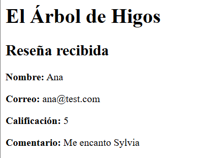
<p style="color:#c2185b; font-style:italic; font-size:13px;">Formulario lleno con datos de prueba</p>
</div>

<br>

<h2 style="color:#c2185b; border-bottom: 3px solid #f48fb1; padding-bottom: 6px;">🌷🌷🌺🌷🌷 Campos utilizados</h2>

<table style="width:100%; border-collapse: collapse;">
<tr style="background-color:#c2185b; color:#ffffff;">
<th style="padding:8px; text-align:left;">Campo</th>
<th style="padding:8px; text-align:left;">Tipo HTML</th>
<th style="padding:8px; text-align:left;">name</th>
</tr>
<tr style="background-color:#fce4ec;"><td style="padding:8px;">Nombre</td><td style="padding:8px;"><code>text</code></td><td style="padding:8px;"><code>nombre</code></td></tr>
<tr style="background-color:#ffffff;"><td style="padding:8px;">Correo electrónico</td><td style="padding:8px;"><code>email</code></td><td style="padding:8px;"><code>correo</code></td></tr>
<tr style="background-color:#fce4ec;"><td style="padding:8px;">Calificación</td><td style="padding:8px;"><code>number</code></td><td style="padding:8px;"><code>calificacion</code></td></tr>
<tr style="background-color:#ffffff;"><td style="padding:8px;">Libro reseñado</td><td style="padding:8px;"><code>text</code></td><td style="padding:8px;"><code>libro</code></td></tr>
<tr style="background-color:#fce4ec;"><td style="padding:8px;">Comentario</td><td style="padding:8px;"><code>textarea</code></td><td style="padding:8px;"><code>comentario</code></td></tr>
<tr style="background-color:#ffffff;"><td style="padding:8px;">Botón enviar</td><td style="padding:8px;"><code>submit</code></td><td style="padding:8px;">—</td></tr>
</table>

<br>

<h2 style="color:#c2185b; border-bottom: 3px solid #f48fb1; padding-bottom: 6px;">💐 GET</h2>

<blockquote style="border-left: 4px solid #f48fb1; background:#fff0f5; padding: 10px 15px; color:#333;">
GET es un método que envía los datos como parte de la URL, después de un signo <code>?</code>, separados por <code>&amp;</code>. Al enviar mi formulario con GET, la URL quedó así:
<br><br>
<code>http://localhost:8000/procesar.php?nombre=Ana&correo=ana%40test.com&calificacion=5&comentario=Me+encanto+Sylvia</code>
<br><br>
Descubrí que si modifico manualmente un valor en la URL (por ejemplo, cambiar <code>calificacion=5</code> por <code>calificacion=100</code>), la página lo acepta sin problema si no hay validación, lo cual demuestra que GET no protege los datos por sí solo.
</blockquote>

<div align="center">
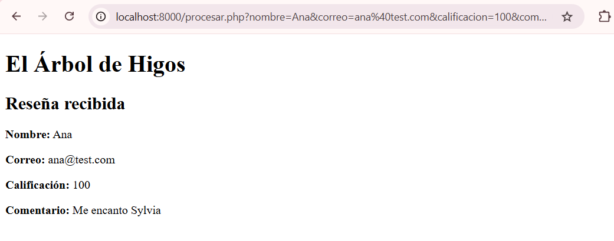
<p style="color:#c2185b; font-style:italic; font-size:13px;">Modificando la calificación directamente en la URL</p>
</div>

<br>

<h2 style="color:#c2185b; border-bottom: 3px solid #f48fb1; padding-bottom: 6px;">🌷🌷🌸🌷🌷 POST</h2>

<blockquote style="border-left: 4px solid #f48fb1; background:#fff0f5; padding: 10px 15px; color:#333;">
POST es un método que envía los datos dentro del cuerpo de la solicitud HTTP, sin mostrarlos en la URL. Al enviar mi formulario con POST, la URL se quedó limpia:
<br><br>
<code>http://localhost:8000/procesar.php</code>
<br><br>
Sin embargo, los datos sí llegaron correctamente al servidor, solo que viajan "escondidos" en vez de visibles.
</blockquote>

<div align="center">
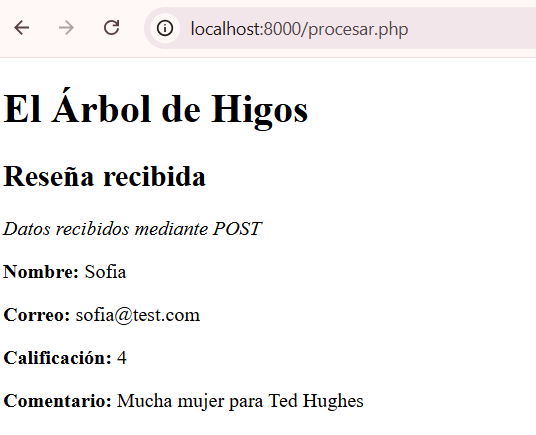
<p style="color:#c2185b; font-style:italic; font-size:13px;">Resultado del envío por POST — URL limpia</p>
</div>

<br>

<h2 style="color:#c2185b; border-bottom: 3px solid #f48fb1; padding-bottom: 6px;"🌷🌷>💕🌷🌷 Recepción de datos con PHP</h2>

<blockquote style="border-left: 4px solid #f48fb1; background:#fff0f5; padding: 10px 15px; color:#333;">
Para recibir los datos utilicé las variables especiales <code>$_GET</code> y <code>$_POST</code>. Como mi formulario puede enviarse por cualquiera de los dos métodos, usé <code>$_SERVER['REQUEST_METHOD']</code> para detectar cuál se utilizó, y así tomar los datos de la variable correcta:
</blockquote>

```php
if ($_SERVER['REQUEST_METHOD'] == 'GET') {
    $nombre = $_GET['nombre'];
} else {
    $nombre = $_POST['nombre'];
}
```

<br>

<h2 style="color:#c2185b; border-bottom: 3px solid #f48fb1; padding-bottom: 6px;">🌷🌷🌷🌷 Validaciones</h2>

<blockquote style="border-left: 4px solid #f48fb1; background:#fff0f5; padding: 10px 15px; color:#333;">
Una validación es el proceso de comprobar que la información recibida sea correcta y tenga sentido, antes de usarla o guardarla. Es necesario validar porque un usuario puede escribir datos incompletos, vacíos o con formato incorrecto, y la aplicación necesita detectarlo antes de procesarlos.
<br><br>
<b>Validaciones implementadas:</b>
<ul>
<li>Que el nombre no esté vacío.</li>
<li>Que el correo no esté vacío y tenga formato válido (usando <code>filter_var()</code>).</li>
<li>Que la calificación no esté vacía, sea numérica y esté entre 1 y 5.</li>
<li>Que el libro reseñado no esté vacío.</li>
<li>Que el comentario no esté vacío.</li>
</ul>
Cuando introduje información incorrecta (por ejemplo, calificación 100 o correo sin formato válido), la aplicación mostró los errores correspondientes. Cuando introduje información correcta, la aplicación mostró el mensaje de confirmación con todos los datos.
</blockquote>

<div align="center">
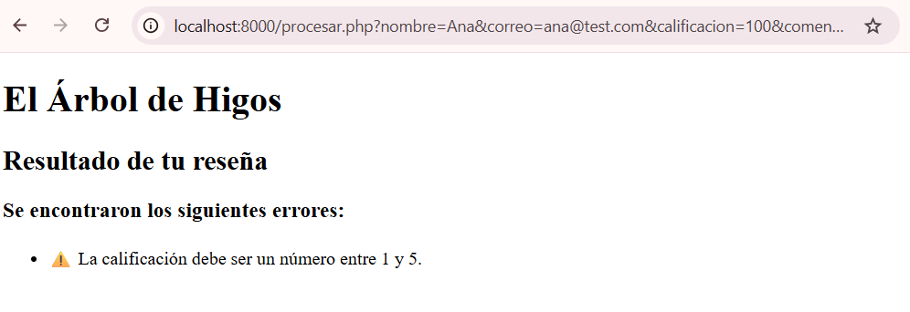
<p style="color:#c2185b; font-style:italic; font-size:13px;">Validación rechazando una calificación fuera de rango</p>
</div>

<br>

<h2 style="color:#c2185b; border-bottom: 3px solid #f48fb1; padding-bottom: 6px;">🌷🌷💗🌷🌷 Mensajes de error</h2>

<blockquote style="border-left: 4px solid #f48fb1; background:#fff0f5; padding: 10px 15px; color:#333;">
Un mensaje de error le indica al usuario qué campo tiene el problema y qué debe corregir. En vez de mostrar un error genérico, cada validación tiene su propio mensaje específico, por ejemplo: "Debes proporcionar un correo válido" o "La calificación debe ser un número entre 1 y 5".
</blockquote>

<div align="center">
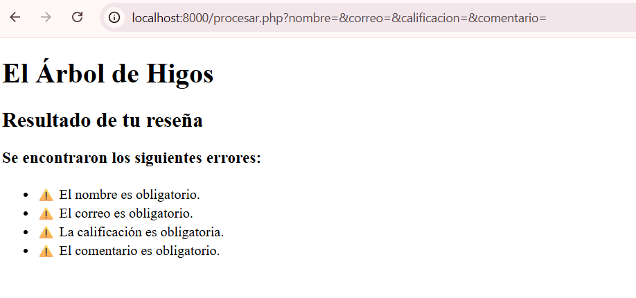
<p style="color:#c2185b; font-style:italic; font-size:13px;">Errores al enviar el formulario vacío</p>
<br>
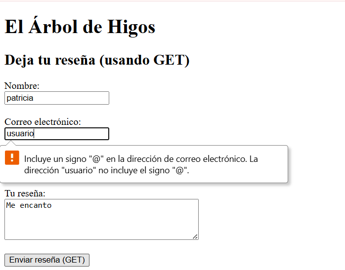
<p style="color:#c2185b; font-style:italic; font-size:13px;">El navegador bloquea un correo sin @ (validación HTML5)</p>
<br>
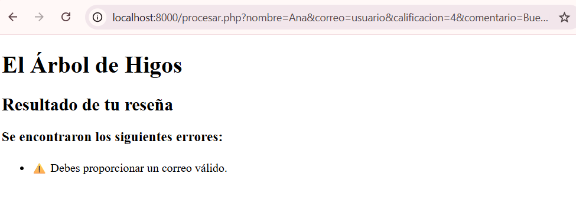
<p style="color:#c2185b; font-style:italic; font-size:13px;">PHP también valida el correo si se fuerza el dato por la URL</p>
</div>

<br>

<h2 style="color:#c2185b; border-bottom: 3px solid #f48fb1; padding-bottom: 6px;">💗💗🌺💗💗 Mensaje de confirmación</h2>

<blockquote style="border-left: 4px solid #f48fb1; background:#fff0f5; padding: 10px 15px; color:#333;">
Un mensaje de confirmación le indica al usuario que su información fue recibida y procesada correctamente. Cuando todos los datos pasaron las validaciones, la aplicación mostró "Información recibida correctamente" junto con un resumen de los datos capturados.
</blockquote>

<div align="center">
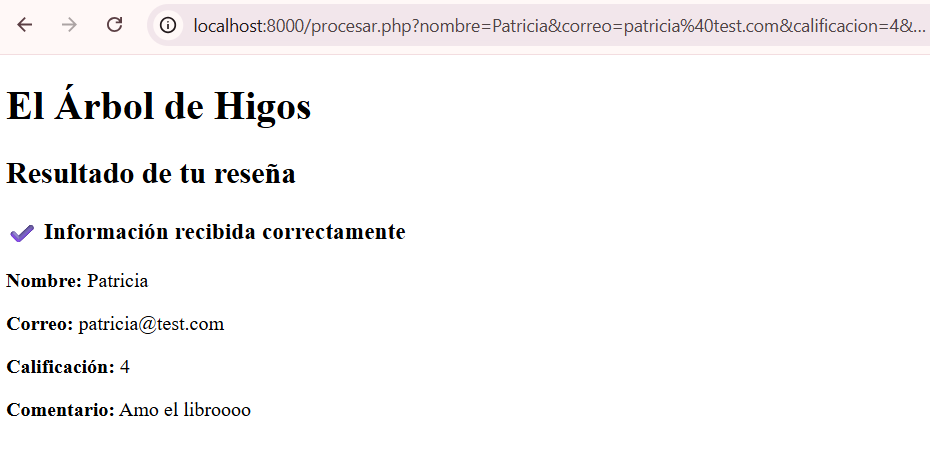
<p style="color:#c2185b; font-style:italic; font-size:13px;">Mensaje de confirmación con los datos procesados</p>
</div>

<br>

<h2 style="color:#c2185b; border-bottom: 3px solid #f48fb1; padding-bottom: 6px;">💗💗💐💗💗 Herramientas de desarrollador</h2>

<blockquote style="border-left: 4px solid #f48fb1; background:#fff0f5; padding: 10px 15px; color:#333;">
Usé la pestaña Network de las DevTools para comparar ambas solicitudes:
<br><br>
<b>GET</b> → Request URL: <code>procesar.php?nombre=patricia&correo=...</code> — Request Method: GET — Status: 200 OK.
<br><br>
<b>POST</b> → Request URL: <code>procesar.php</code> (limpia) — Request Method: POST — Status: 200 OK. Los datos aparecieron en la pestaña Payload como "Form Data", demostrando que sí llegaron al servidor aunque no se vean en la URL.
</blockquote>

<div align="center">
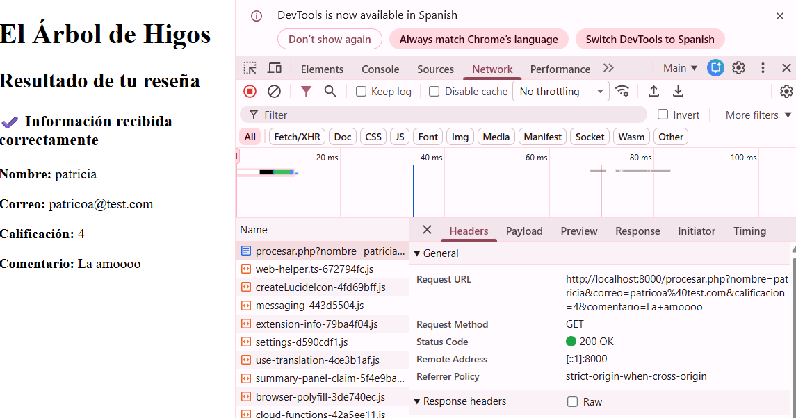
<p style="color:#c2185b; font-style:italic; font-size:13px;">Headers de la solicitud GET</p>
<br>
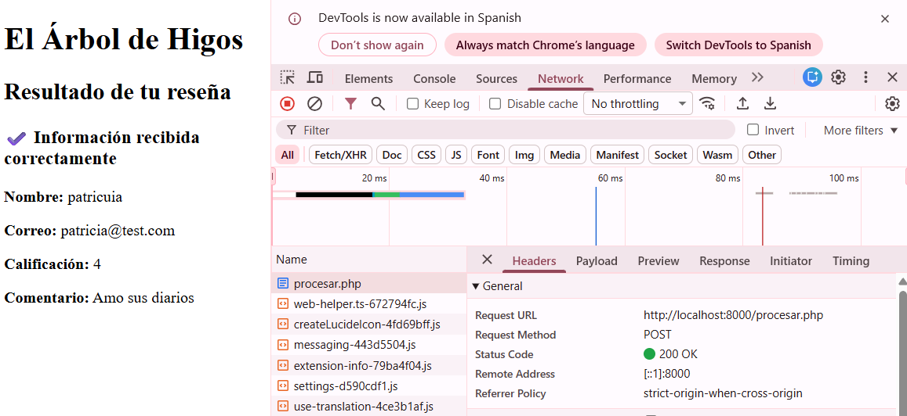
<p style="color:#c2185b; font-style:italic; font-size:13px;">Headers de la solicitud POST</p>
<br>
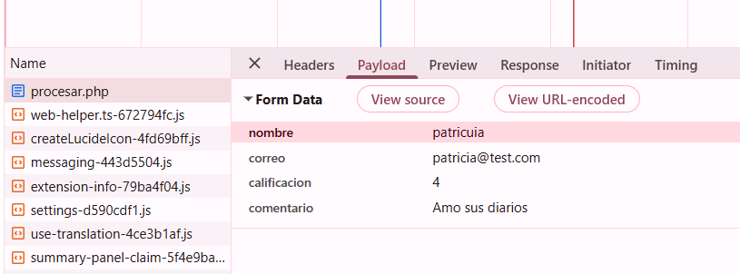
<p style="color:#c2185b; font-style:italic; font-size:13px;">Payload (Form Data) de la solicitud POST</p>
</div>

<br>

<h2 style="color:#c2185b; border-bottom: 3px solid #f48fb1; padding-bottom: 6px;">💗💗💐💐 Experimento GET vs POST</h2>

<table style="width:100%; border-collapse: collapse;">
<tr style="background-color:#c2185b; color:#ffffff;">
<th style="padding:8px; text-align:left;"></th>
<th style="padding:8px; text-align:left;">GET</th>
<th style="padding:8px; text-align:left;">POST</th>
</tr>
<tr style="background-color:#fce4ec;"><td style="padding:8px;"><b>¿Dónde van los datos?</b></td><td style="padding:8px;">Visibles en la URL</td><td style="padding:8px;">Escondidos en el cuerpo (Payload)</td></tr>
<tr style="background-color:#ffffff;"><td style="padding:8px;"><b>¿Se pueden modificar en la URL?</b></td><td style="padding:8px;">Sí, fácilmente</td><td style="padding:8px;">No directamente</td></tr>
<tr style="background-color:#fce4ec;"><td style="padding:8px;"><b>Variable PHP</b></td><td style="padding:8px;"><code>$_GET</code></td><td style="padding:8px;"><code>$_POST</code></td></tr>
<tr style="background-color:#ffffff;"><td style="padding:8px;"><b>¿Cuándo usarlo?</b></td><td style="padding:8px;">Para compartir enlaces con datos (ej. búsquedas)</td><td style="padding:8px;">Para datos sensibles (ej. correos, contraseñas)</td></tr>
</table>

<br>

<h2 style="color:#c2185b; border-bottom: 3px solid #f48fb1; padding-bottom: 6px;">💗💗💕💗💗 Pruebas realizadas</h2>

<blockquote style="border-left: 4px solid #f48fb1; background:#fff0f5; padding: 10px 15px; color:#333;">
<b>Prueba 1 — Formulario vacío:</b> al enviar sin llenar nada, aparecieron los 4 mensajes de error correspondientes.
<br><br>
<b>Prueba 2 — Correo incorrecto:</b> el navegador bloqueó primero un correo sin @ (validación HTML5); al forzar el dato inválido por la URL, PHP también lo rechazó.
<br><br>
<b>Prueba 3 — Dato numérico incorrecto:</b> al modificar la calificación a 100 directamente en la URL, PHP mostró el error de rango.
<br><br>
<b>Prueba 4 — Modificación de datos:</b> envié información correcta y luego cambié un valor; el resultado se actualizó correctamente.
<br><br>
<b>Prueba 5 — GET vs POST:</b> comparé ambos métodos con las mismas herramientas de desarrollador, documentado en la sección anterior.
<br><br>
<b>Prueba 6 — Campo adicional:</b> agregué el campo "Libro reseñado", hice que PHP lo recibiera, lo validara y lo mostrara en la confirmación.
</blockquote>

<div align="center">
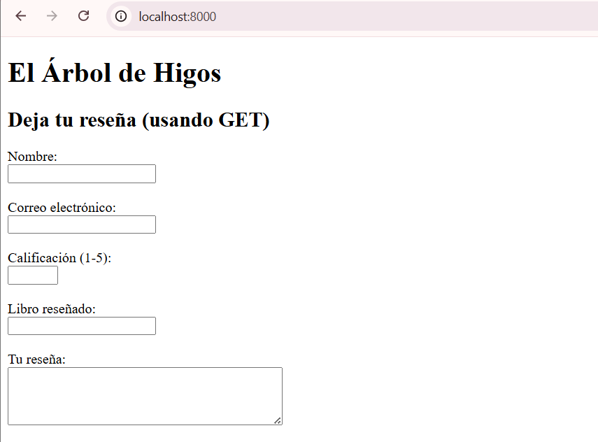
<p style="color:#c2185b; font-style:italic; font-size:13px;">Nuevo campo "Libro reseñado" agregado al formulario</p>
<br>
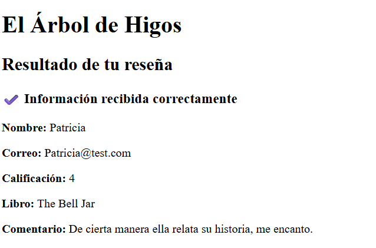
<p style="color:#c2185b; font-style:italic; font-size:13px;">PHP recibiendo y mostrando el nuevo campo</p>
</div>

<br>

<h2 style="color:#c2185b; border-bottom: 3px solid #f48fb1; padding-bottom: 6px;">💗💗🌷💗💗 Problemas encontrados</h2>

<table style="width:100%; border-collapse: collapse;">
<tr style="background-color:#fce4ec;"><td style="padding:8px;"><b>Qué ocurrió</b></td><td style="padding:8px;">Al quitar un punto y coma en la línea que recibía la variable <code>$libro</code>, apareció un error de sintaxis.</td></tr>
<tr style="background-color:#ffffff;"><td style="padding:8px;"><b>Mensaje exacto</b></td><td style="padding:8px;"><code>Parse error: syntax error, unexpected variable "$comentario" in procesar.php on line 17</code></td></tr>
<tr style="background-color:#fce4ec;"><td style="padding:8px;"><b>Causa</b></td><td style="padding:8px;">Faltaba el punto y coma al final de <code>$libro = $_GET['libro']</code>, por lo que PHP no supo dónde terminaba esa instrucción.</td></tr>
</table>

<div align="center">
<table style="width:100%; margin-top:10px;">
<tr>
<td align="center" width="50%">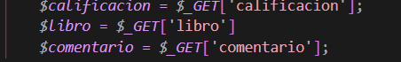<p style="font-size:12px; color:#a33a2e;">Código con el error</p></td>
<td align="center" width="50%">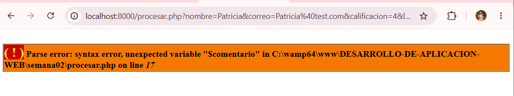<p style="font-size:12px; color:#a33a2e;">Error mostrado en el navegador</p></td>
</tr>
</table>
</div>

<br>

<h2 style="color:#c2185b; border-bottom: 3px solid #f48fb1; padding-bottom: 6px;">🌸 Soluciones aplicadas</h2>

<blockquote style="border-left: 4px solid #f48fb1; background:#fff0f5; padding: 10px 15px; color:#333;">
Identifiqué que faltaba el punto y coma al final de la línea señalada, y lo agregué de nuevo, lo que restauró el funcionamiento normal del formulario.
</blockquote>

<div align="center">
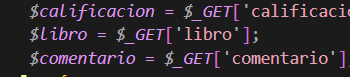
<p style="color:#2e7d32; font-style:italic; font-size:13px;">Página funcionando de nuevo tras la corrección</p>
</div>

<br>

<h2 style="color:#c2185b; border-bottom: 3px solid #f48fb1; padding-bottom: 6px;">💐 Investigación</h2>

<blockquote style="border-left: 4px solid #f48fb1; background:#fff0f5; padding: 10px 15px; color:#333;">
<b>Formulario HTML:</b> es un elemento que permite al usuario capturar información y enviarla a otro archivo para ser procesada.
<br><br>
<b>input:</b> es la etiqueta que crea un campo donde el usuario puede escribir o seleccionar información.
<br><br>
<b>name:</b> es el atributo que identifica cada campo, para que PHP sepa a qué dato corresponde cada valor recibido.
<br><br>
<b>action:</b> indica a qué archivo se envía la información del formulario.
<br><br>
<b>method:</b> indica cómo se envía la información: GET o POST.
<br><br>
<b>GET:</b> método que envía los datos como parte de la URL, después de un signo <code>?</code>.
<br><br>
<b>POST:</b> método que envía los datos dentro del cuerpo de la solicitud, sin mostrarlos en la URL.
<br><br>
<b>$_GET:</b> variable especial de PHP que contiene los datos enviados por GET.
<br><br>
<b>$_POST:</b> variable especial de PHP que contiene los datos enviados por POST.
<br><br>
<b>Validación:</b> proceso de comprobar que la información recibida sea correcta antes de usarla.
<br><br>
<b>Mensaje de error:</b> aviso que indica al usuario qué campo debe corregir.
<br><br>
<b>Mensaje de confirmación:</b> aviso que indica al usuario que su información fue procesada correctamente.
</blockquote>

<br>

<h2 style="color:#c2185b; border-bottom: 3px solid #f48fb1; padding-bottom: 6px;">💕 Recorrido de los datos</h2>

<blockquote style="border-left: 4px solid #f48fb1; background:#fff0f5; padding: 10px 15px; color:#333;">
El usuario captura información en el formulario HTML, usando elementos <code>&lt;input&gt;</code> y <code>&lt;textarea&gt;</code>. Al presionar el botón de envío, el navegador junta todos los datos y los envía al archivo indicado en <code>action</code>, mediante el método indicado en <code>method</code>, transportado por el protocolo HTTP.
<br><br>
PHP recibe la información en el servidor usando <code>$_GET</code> o <code>$_POST</code> según corresponda. La diferencia entre ambas es que <code>$_GET</code> contiene datos que llegaron visibles en la URL, mientras que <code>$_POST</code> contiene datos que llegaron escondidos en el cuerpo de la solicitud.
<br><br>
Después, PHP valida la información: si es incorrecta, muestra mensajes de error específicos; si es correcta, muestra un mensaje de confirmación con los datos procesados. Finalmente, el navegador recibe una página HTML con ese resultado, sin ver nunca el código PHP que lo generó.
</blockquote>

<br>

<h2 style="color:#c2185b; border-bottom: 3px solid #f48fb1; padding-bottom: 6px;">🌷 Reflexión final</h2>

<blockquote style="border-left: 4px solid #f48fb1; background:#fff0f5; padding: 10px 15px; color:#333;">
Esta semana entendí que una aplicación web no solo muestra información, sino que también puede recibirla del usuario. Aprendí que existen dos formas de enviar esa información (GET y POST), cada una con sus propias ventajas y riesgos, y que nunca debo confiar solo en la validación del navegador, porque los datos pueden llegar de otras formas (como modificando la URL directamente). Validar la información en PHP es fundamental para que la aplicación funcione correctamente y de forma segura. Esta práctica conecta directamente con la de la semana pasada: si antes aprendí a mostrar información generada por PHP, ahora aprendí a recibir información desde el usuario.
</blockquote>

<br>