<table style="width:100%; border:none; margin-bottom:20px;">
<tr>
<td width="120" align="center" style="border:none;">

</td>
<td align="right" style="border:none; padding: 20px 10px;">
<h1 style="color:#c2185b; font-family: Georgia, serif; letter-spacing: 2px; margin-bottom:5px;">🌷🌷🌷💐💐EL ÁRBOL DE HIGOS💐💐🌷🌷🌷</h1>

💗💗Semana 03 — CSS: hagamos que se vea bien💗💗

Desarrollo de Aplicaciones Web

</td>
</tr>
</table>

 

<table style="width:100%; border-collapse: collapse;">
<tr style="background-color:#c2185b; color:#ffffff;">
<td style="padding:8px;"><b>Alumna</b></td>
<td style="padding:8px;">Patricia Segura Resendiz</td>
</tr>
<tr style="background-color:#fce4ec;">
<td style="padding:8px;"><b>Institución</b></td>
<td style="padding:8px;">Instituto Tecnológico Superior de Rioverde</td>
</tr>
<tr style="background-color:#c2185b; color:#ffffff;">
<td style="padding:8px;"><b>Carrera</b></td>
<td style="padding:8px;">Ingeniería en Sistemas Computacionales</td>
</tr>
<tr style="background-color:#fce4ec;">
<td style="padding:8px;"><b>Docente</b></td>
<td style="padding:8px;">Ing. José de Jesús Collazo Reyes</td>
</tr>
<tr style="background-color:#c2185b; color:#ffffff;">
<td style="padding:8px;"><b>Entorno</b></td>
<td style="padding:8px;">WampServer · Apache 2.4.59 · PHP 8.2.18</td>
</tr>
</table>

 

<h2 style="color:#c2185b; border-bottom: 3px solid #f48fb1; padding-bottom: 6px;">🌸💗💗Objetivo</h2>

<blockquote style="border-left: 4px solid #f48fb1; background:#fff0f5; padding: 10px 15px; color:#333;">
Aprendí a usar CSS para transformar mi tienda de libros, que hasta ahora solo funcionaba, en una interfaz organizada y agradable visualmente. Trabajé con selectores, el modelo de caja, Flexbox, diseño de formularios y diseño adaptable con media queries, integrando todo esto a mi proyecto real sin empezar desde cero.
</blockquote>

 

<h2 style="color:#c2185b; border-bottom: 3px solid #f48fb1; padding-bottom: 6px;">🌷🌷Aplicación web🌷🌷🌷</h2>

<blockquote style="border-left: 4px solid #f48fb1; background:#fff0f5; padding: 10px 15px; color:#333;">
Esta semana mi tienda de libros "El Árbol de Higos" dejó de verse como una página HTML básica. Le apliqué una hoja de estilos externa que le da colores, tipografía, espacios y una organización visual clara, manteniendo la misma funcionalidad de formularios que construí en la Semana 02.
</blockquote>

 

<h2 style="color:#c2185b; border-bottom: 3px solid #f48fb1; padding-bottom: 6px;">💗💗💗HTML utilizado</h2>

<blockquote style="border-left: 4px solid #f48fb1; background:#fff0f5; padding: 10px 15px; color:#333;">
Reutilicé el HTML de mi formulario de reseñas de la Semana 02 (campos de nombre, correo, calificación, libro y comentario), y le agregué contenedores nuevos (<code>&lt;div id="principal"&gt;</code> y <code>&lt;div class="formularios-container"&gt;</code>) para poder aplicarles estilos y organizarlos con Flexbox.
</blockquote>

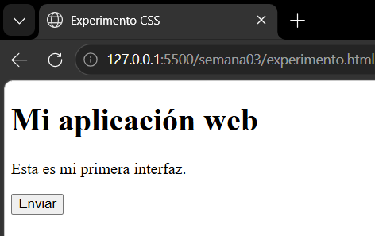

Página de experimento sin ningún CSS aplicado

 

<h2 style="color:#c2185b; border-bottom: 3px solid #f48fb1; padding-bottom: 6px;">🌺💗💗Hoja de estilos</h2>

<blockquote style="border-left: 4px solid #f48fb1; background:#fff0f5; padding: 10px 15px; color:#333;">
Creé una hoja de estilos externa llamada <code>estilos.css</code>, vinculada desde <code>index.php</code> mediante:
  
<code>&lt;link rel="stylesheet" href="estilos.css"&gt;</code>
  
Separar el CSS del HTML/PHP me permite cambiar toda la apariencia de mi tienda editando un solo archivo, sin tocar la estructura ni la lógica del proyecto.
</blockquote>

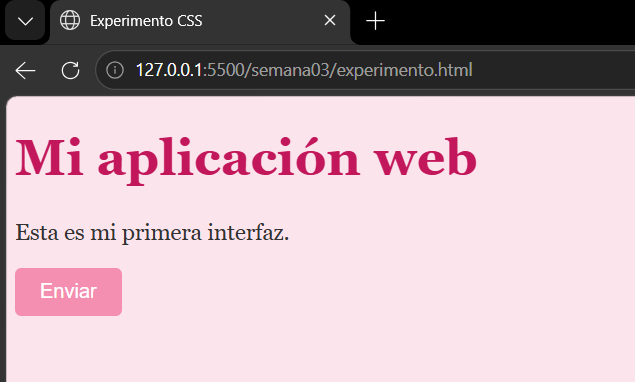

Misma página, ahora con CSS conectado (experimento inicial)

 
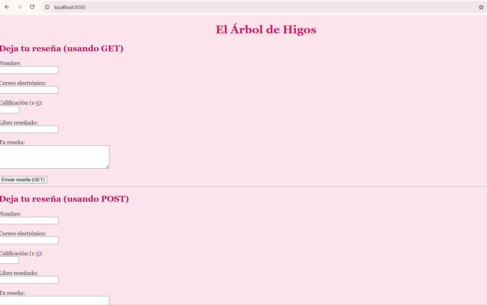

estilos.css conectado a mi proyecto real

 

<h2 style="color:#c2185b; border-bottom: 3px solid #f48fb1; padding-bottom: 6px;">💐💕💕Selectores CSS</h2>

<blockquote style="border-left: 4px solid #f48fb1; background:#fff0f5; padding: 10px 15px; color:#333;">
Utilicé los tres tipos de selectores: por elemento (<code>body</code>, <code>h1</code>, <code>h2</code>), por clase (<code>.destacado</code>) y por id (<code>#principal</code>). El que más utilicé fue el selector por elemento, para mantener consistencia en toda la página.
  
<b>Experimento de especificidad:</b> agregué una regla <code>h2 { color: red; }</code> mientras ya tenía <code>.destacado { color: #e91e8c; }</code> aplicada a uno de mis títulos. El resultado: el <code>&lt;h2&gt;</code> con la clase se quedó rosa, mientras que el otro <code>&lt;h2&gt;</code> (sin clase) se puso rojo. Esto me mostró que una clase es más específica que un selector de elemento, por lo que la clase "gana" el conflicto.
</blockquote>

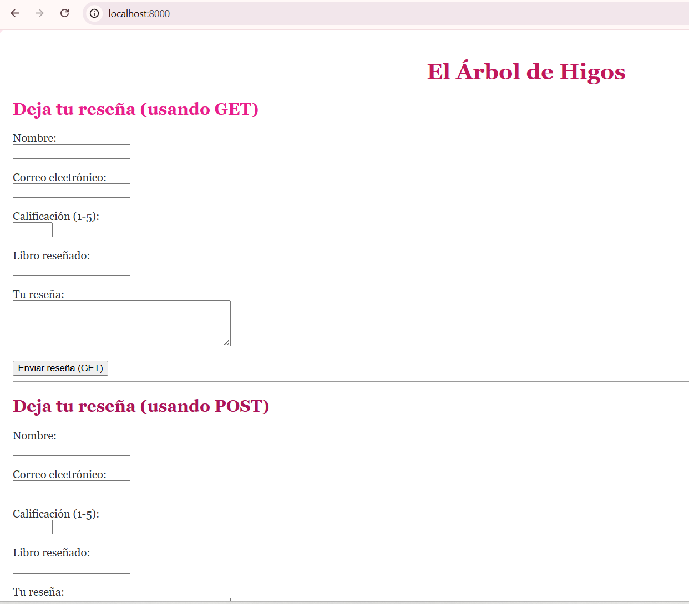

Clase e id aplicados a mi proyecto

 
<table style="width:100%;">
<tr>
<td align="center" width="50%">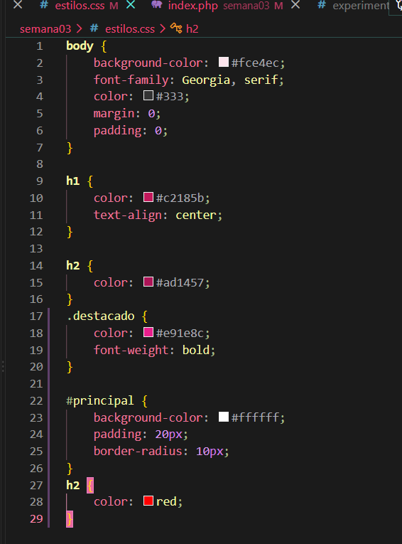
Código con ambas reglas en conflicto
</td>
<td align="center" width="50%">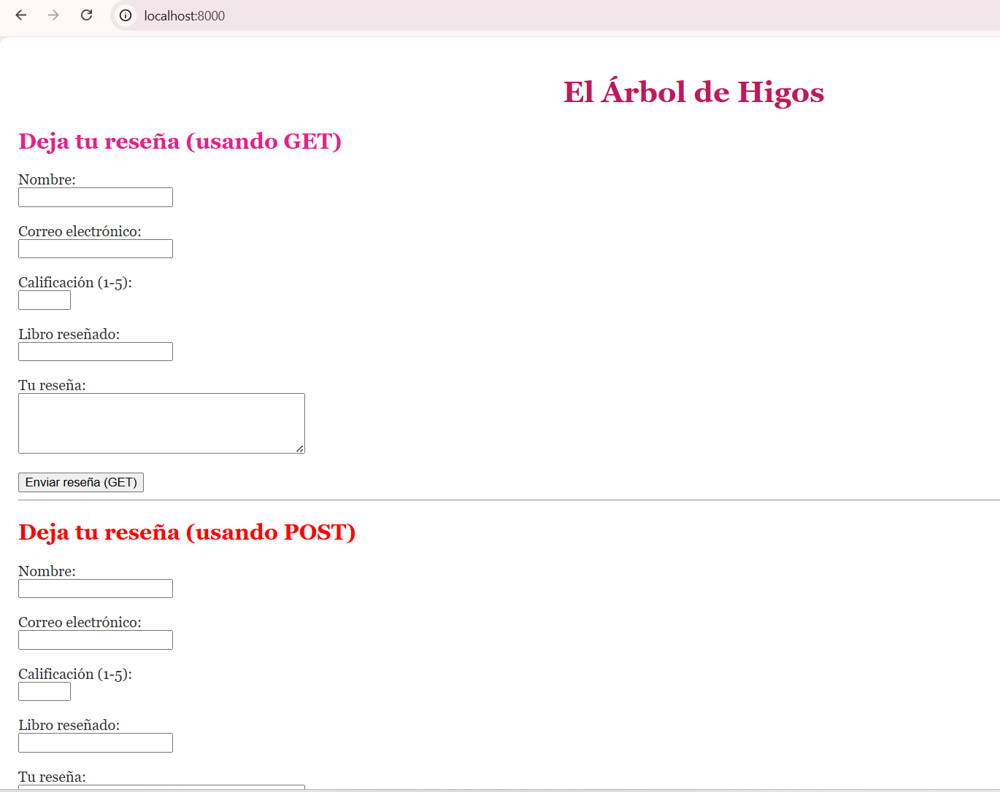
Resultado: la clase gana
</td>
</tr>
</table>

 

<h2 style="color:#c2185b; border-bottom: 3px solid #f48fb1; padding-bottom: 6px;">🌸💗💗Modelo de caja</h2>

<blockquote style="border-left: 4px solid #f48fb1; background:#fff0f5; padding: 10px 15px; color:#333;">
El modelo de caja es la forma en que CSS entiende cada elemento: contenido, rodeado de padding (espacio interno), luego border (borde), y finalmente margin (espacio externo).
  
<b>Margin:</b> es el espacio que separa un elemento de los elementos que lo rodean.
  
<b>Padding:</b> es el espacio entre el borde del elemento y su contenido interno.
  
<b>Border:</b> dibuja una línea/borde alrededor del elemento.
  
Al aumentar el <code>padding</code> de 20px a 60px en mi caja de prueba, la caja se hizo visiblemente más grande, porque crece el espacio entre el borde y el contenido. Esta diferencia fue más fácil de notar que con el <code>margin</code>, ya que mi caja de prueba no tenía elementos cercanos con los cuales comparar la separación.
</blockquote>

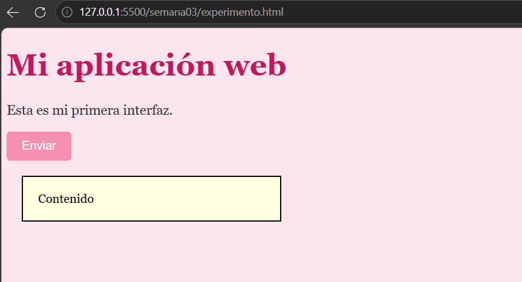

Caja de prueba con margin, padding y border

 
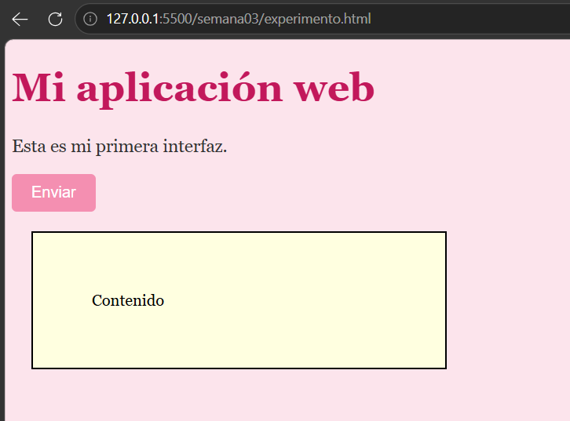

Misma caja con el padding aumentado a 60px

 

<h2 style="color:#c2185b; border-bottom: 3px solid #f48fb1; padding-bottom: 6px;">💗💗💗💕 Flexbox</h2>

<blockquote style="border-left: 4px solid #f48fb1; background:#fff0f5; padding: 10px 15px; color:#333;">
Flexbox es un sistema de CSS para organizar elementos dentro de un contenedor de forma flexible. Al aplicar <code>display: flex</code> a un contenedor con 3 elementos, estos se acomodaron automáticamente en fila, en vez de apilarse verticalmente como harían por defecto.
  
Con <code>justify-content: space-between</code> los elementos se separaron, dejando espacio equitativo entre ellos. Con <code>align-items: center</code> los centré verticalmente dentro del contenedor.
  
Apliqué Flexbox a una sección real de mi proyecto: el contenedor de mis dos formularios (<code>.formularios-container</code>), que ahora se muestran uno al lado del otro en pantallas grandes.
</blockquote>

<table style="width:100%;">
<tr>
<td align="center" width="33%">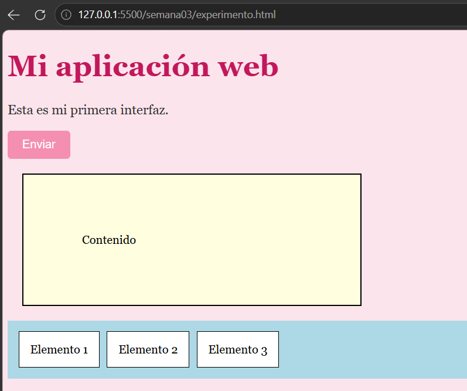
display: flex básico
</td>
<td align="center" width="33%">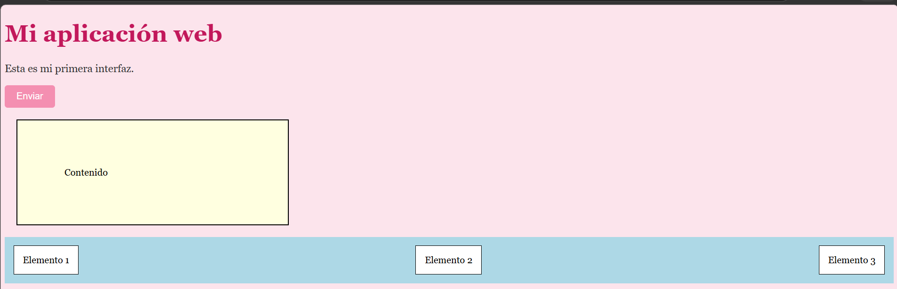
justify-content: space-between
</td>
<td align="center" width="33%">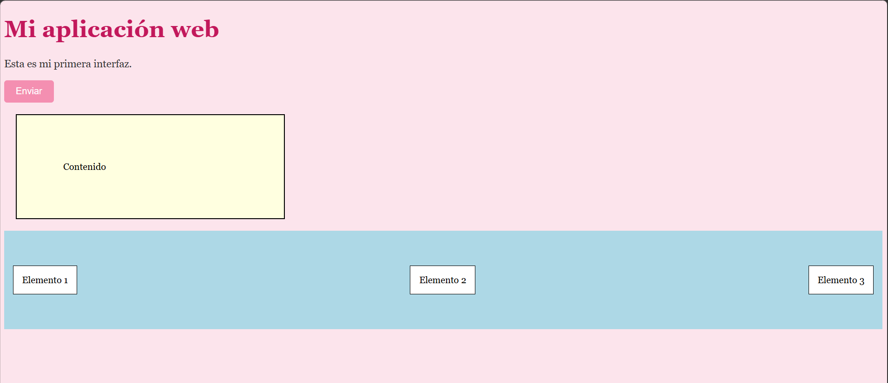
align-items: center
</td>
</tr>
</table>
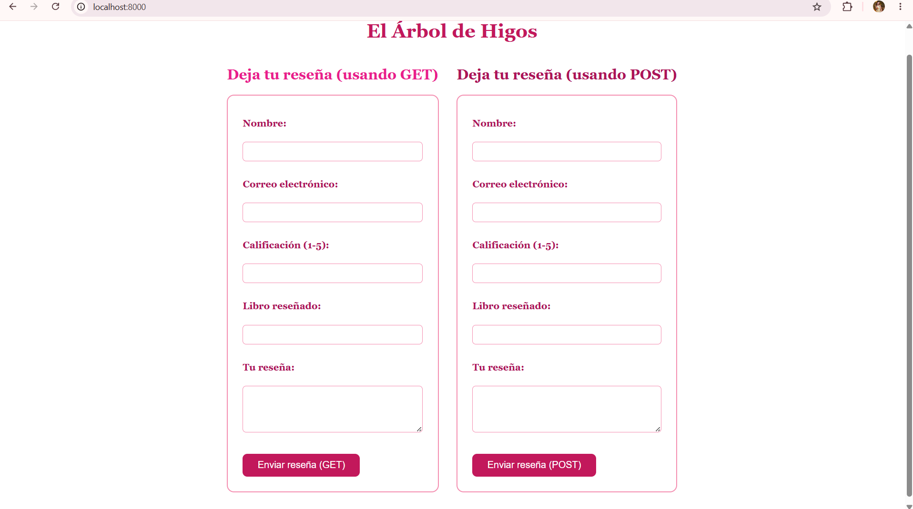

Flexbox aplicado a mis dos formularios (GET y POST)

 

<h2 style="color:#c2185b; border-bottom: 3px solid #f48fb1; padding-bottom: 6px;">🌷💗💗💕Diseño del formulario</h2>

<blockquote style="border-left: 4px solid #f48fb1; background:#fff0f5; padding: 10px 15px; color:#333;">
Apliqué estilos a <code>form</code>, <code>label</code>, <code>input</code>, <code>textarea</code> y <code>button</code>: bordes redondeados, colores rosa consistentes con mi marca, espaciado entre campos, y un ancho máximo para que no se estire demasiado. También agregué un estado visual con <code>button:hover</code>, que cambia el color del botón cuando el mouse pasa por encima.
</blockquote>

<table style="width:100%;">
<tr>
<td align="center" width="50%">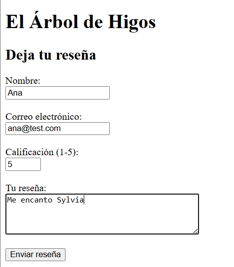
Antes (Semana 02, sin CSS)
</td>
<td align="center" width="50%">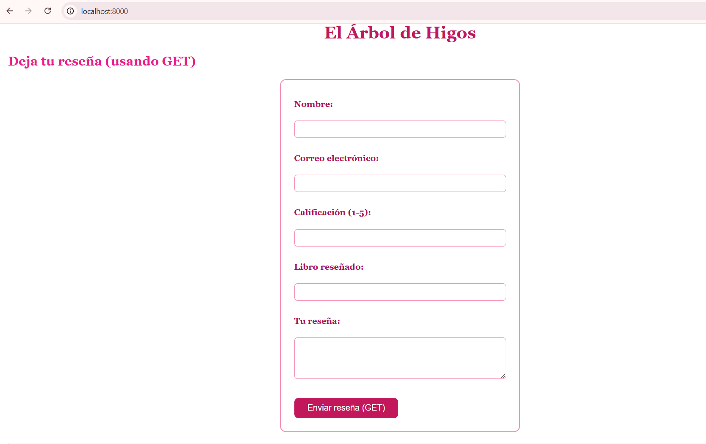
Después (con CSS aplicado)
</td>
</tr>
</table>

 

<h2 style="color:#c2185b; border-bottom: 3px solid #f48fb1; padding-bottom: 6px;">💐💗💗💗💕 Diseño de la tabla</h2>

<blockquote style="border-left: 4px solid #f48fb1; background:#fff0f5; padding: 10px 15px; color:#333;">
Mi proyecto no utiliza tablas por el momento, ya que mi aplicación se basa en formularios de reseñas. Esta sección quedará implementada en una semana futura si mi proyecto llega a necesitar mostrar información en formato de tabla (por ejemplo, un listado de reseñas recibidas).
</blockquote>

 

<h2 style="color:#c2185b; border-bottom: 3px solid #f48fb1; padding-bottom: 6px;">🌸💗💗 Diseño adaptable</h2>

<blockquote style="border-left: 4px solid #f48fb1; background:#fff0f5; padding: 10px 15px; color:#333;">
El diseño adaptable evita que el contenido se vea apretado o mal organizado en pantallas pequeñas. Utilicé <code>@media (max-width: 600px)</code> para cambiar la dirección de mis formularios de fila a columna, y hacer que ocuparan el 100% del ancho disponible en vez de un ancho fijo.
  
Confirmé con las herramientas de desarrollador que la regla se activaba correctamente al reducir el ancho de la ventana: los formularios pasaron de estar lado a lado a apilarse en columna.
</blockquote>

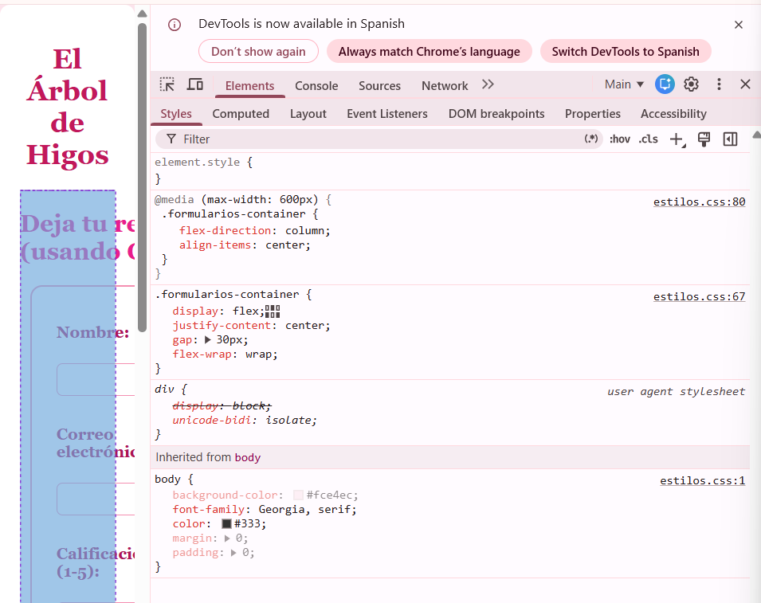

Vista en columna (pantalla angosta) — @media activo

 
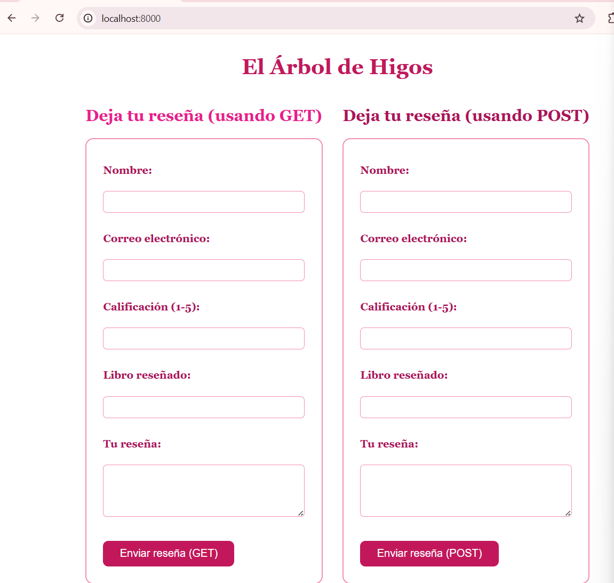

Vista lado a lado (pantalla ancha)

 

<h2 style="color:#c2185b; border-bottom: 3px solid #f48fb1; padding-bottom: 6px;">💕💐💐💐💕 Herramientas de desarrollador</h2>

<blockquote style="border-left: 4px solid #f48fb1; background:#fff0f5; padding: 10px 15px; color:#333;">
Usé la pestaña Elements y el panel Styles para revisar qué clases e ids tenía cada elemento, qué propiedades CSS se le aplicaban, y confirmar con palomitas verdes que mis reglas de <code>@media</code> se activaban correctamente. También descubrí que se pueden modificar propiedades CSS temporalmente desde ahí, aunque esos cambios no permanecen después de recargar la página, ya que el navegador vuelve a cargar el archivo CSS real.
</blockquote>

 

<h2 style="color:#c2185b; border-bottom: 3px solid #f48fb1; padding-bottom: 6px;">💐💐💐💕 Experimentos realizados</h2>

<blockquote style="border-left: 4px solid #f48fb1; background:#fff0f5; padding: 10px 15px; color:#333;">
<b>Experimento 1 — Cambiar apariencia:</b> modifiqué colores, tamaños de texto y espacios en mi hoja de estilos, observando cómo cada cambio afectaba visualmente mi tienda sin tocar el HTML.
  
<b>Experimento 2 — Romper el diseño:</b> escribí mal la propiedad <code>border</code> como <code>bordrr</code>. A diferencia de PHP, el navegador no mostró ningún mensaje de error; simplemente ignoró esa línea y el borde rosa de mis formularios desapareció.
  
<b>Experimento 3 — Cambiar una clase:</b> cambié el nombre de la clase en el HTML (<code>formularios-contenido</code>) dejando el CSS con el nombre original (<code>.formularios-container</code>). Al no coincidir, el estilo dejó de aplicarse y mis formularios volvieron a apilarse verticalmente.
</blockquote>

<table style="width:100%;">
<tr>
<td align="center" width="33%">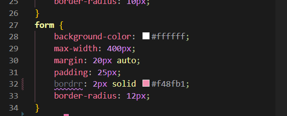
Error: bordrr en vez de border
</td>
<td align="center" width="33%">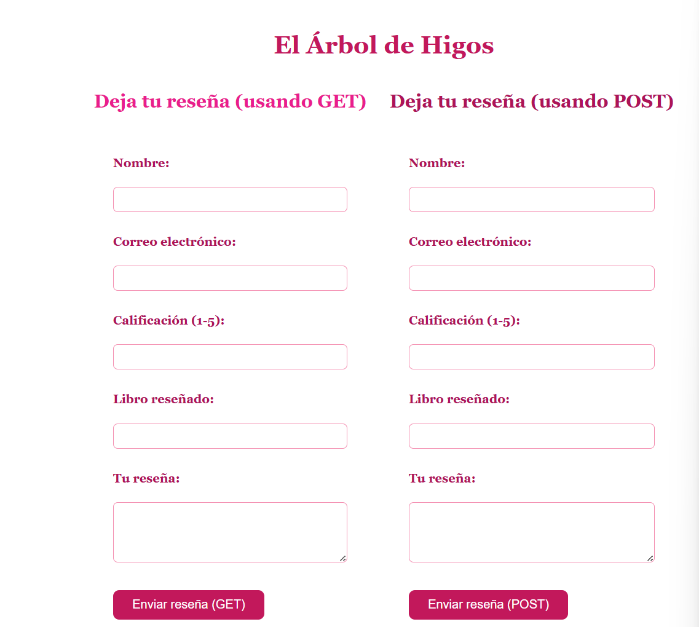
Resultado: sin bordes
</td>
<td align="center" width="33%">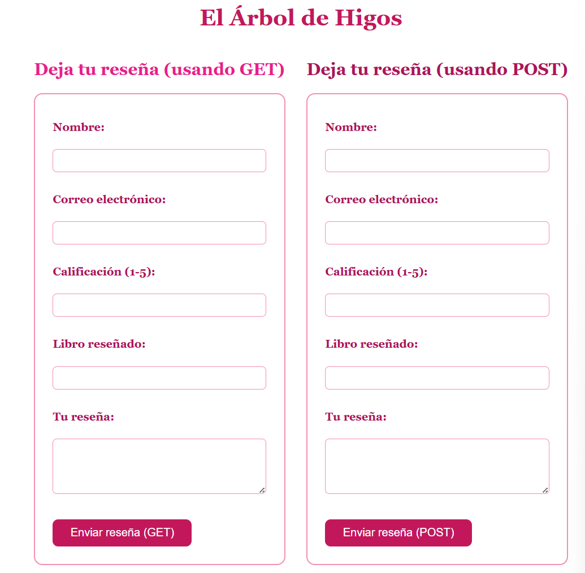
Corregido
</td>
</tr>
</table>
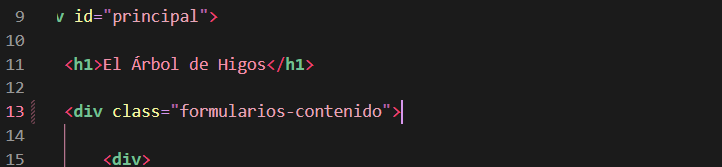

Clase que no coincide: el Flexbox deja de aplicarse

 

<h2 style="color:#c2185b; border-bottom: 3px solid #f48fb1; padding-bottom: 6px;">💐💐💐💕 Problemas encontrados</h2>

<table style="width:100%; border-collapse: collapse;">
<tr style="background-color:#fce4ec;"><td style="padding:8px;"><b>Qué ocurrió</b></td><td style="padding:8px;">Al escribir mal la propiedad <code>border</code> como <code>bordrr</code>, el borde rosa de mis formularios desapareció, sin ningún mensaje de error visible.</td></tr>
<tr style="background-color:#ffffff;"><td style="padding:8px;"><b>Causa</b></td><td style="padding:8px;">Un error de tecleo en el nombre de la propiedad CSS. El navegador no reconoce <code>bordrr</code> como una propiedad válida, así que simplemente la ignora.</td></tr>
<tr style="background-color:#fce4ec;"><td style="padding:8px;"><b>Otro problema</b></td><td style="padding:8px;">Al probar el diseño adaptable, pensé que el <code>@media</code> no funcionaba porque no veía cambios al reducir la ventana manualmente.</td></tr>
<tr style="background-color:#ffffff;"><td style="padding:8px;"><b>Causa</b></td><td style="padding:8px;">En realidad sí funcionaba; el problema era que no estaba reduciendo lo suficiente el ancho real de la página, ya que las DevTools ocupaban parte de la pantalla.</td></tr>
</table>

 

<h2 style="color:#c2185b; border-bottom: 3px solid #f48fb1; padding-bottom: 6px;">🌸🌸🌸💕 Soluciones aplicadas</h2>

<blockquote style="border-left: 4px solid #f48fb1; background:#fff0f5; padding: 10px 15px; color:#333;">
Para el error de la propiedad mal escrita, revisé mi código letra por letra y corregí <code>bordrr</code> de vuelta a <code>border</code>, lo que restauró los bordes visualmente.
  
Para confirmar el diseño adaptable, utilicé el panel de Styles de las herramientas de desarrollador, donde pude ver con palomitas verdes que mi regla <code>@media</code> sí se estaba aplicando correctamente, resolviendo mi duda sin necesidad de adivinar.
</blockquote>

 

<h2 style="color:#c2185b; border-bottom: 3px solid #f48fb1; padding-bottom: 6px;">💕🌸💐💐 Investigación</h2>

<blockquote style="border-left: 4px solid #f48fb1; background:#fff0f5; padding: 10px 15px; color:#333;">
<b>CSS:</b> lenguaje que controla la apariencia visual de una página web.
  
<b>Selector:</b> la forma en que CSS elige a qué elemento(s) aplicar un estilo.
  
<b>Clase:</b> identificador (con punto) que se puede aplicar a varios elementos distintos.
  
<b>Id:</b> identificador (con gato) único para un solo elemento en toda la página.
  
<b>Modelo de caja:</b> la forma en que CSS entiende cada elemento, como una caja de contenido, padding, border y margin.
  
<b>Margin:</b> espacio que separa un elemento de los que lo rodean.
  
<b>Padding:</b> espacio entre el borde de un elemento y su contenido.
  
<b>Border:</b> línea/borde alrededor del elemento.
  
<b>Flexbox:</b> sistema de CSS para organizar elementos de forma flexible dentro de un contenedor.
  
<b>display: flex:</b> convierte un contenedor en flexible, acomodando sus hijos en fila por defecto.
  
<b>justify-content:</b> controla la distribución horizontal de los elementos dentro de un contenedor flex.
  
<b>align-items:</b> controla la alineación vertical de los elementos dentro de un contenedor flex.
  
<b>Diseño adaptable:</b> hacer que una página se vea bien en distintos tamaños de pantalla.
  
<b>@media:</b> regla de CSS que aplica estilos solo bajo ciertas condiciones, como un ancho máximo de pantalla.
</blockquote>

 

<h2 style="color:#c2185b; border-bottom: 3px solid #f48fb1; padding-bottom: 6px;">🌷🌸🌸Relación entre HTML, CSS y PHP</h2>

<blockquote style="border-left: 4px solid #f48fb1; background:#fff0f5; padding: 10px 15px; color:#333;">
HTML define la estructura (títulos, formularios, botones). CSS define la apariencia de esa estructura (colores, tamaños, espacios). PHP procesa la lógica: recibe datos, los valida, y genera el HTML final.
  
CSS es interpretado por el navegador, igual que HTML — nunca se ejecuta en el servidor. CSS no reemplaza a HTML porque necesita que HTML ya haya creado los elementos para poder darles estilo; tampoco reemplaza a PHP porque no puede procesar información ni tomar decisiones lógicas.
  
Cuando el navegador carga mi página, primero recibe el HTML generado por PHP, encuentra la etiqueta <code>&lt;link rel="stylesheet"&gt;</code>, descarga el archivo CSS, y aplica esos estilos antes de mostrar la página final. Si el archivo CSS no existiera, la página se vería sin ningún estilo, solo con la apariencia básica del navegador. Y si el nombre de una clase no coincide entre el HTML y el CSS (como comprobé en mi Experimento 3), ese estilo simplemente no se aplica.
</blockquote>

 

<h2 style="color:#c2185b; border-bottom: 3px solid #f48fb1; padding-bottom: 6px;">💐🌸🌸🌸 Antes y después</h2>

<table style="width:100%;">
<tr>
<td align="center" width="50%">
<b>Antes</b> — Semana 02, sin CSS
</td>
<td align="center" width="50%">
<b>Después</b> — Semana 03, con CSS completo
</td>
</tr>
</table>

 

<h2 style="color:#c2185b; border-bottom: 3px solid #f48fb1; padding-bottom: 6px;">🌸🌸🌸🌸 Reflexión final</h2>

<blockquote style="border-left: 4px solid #f48fb1; background:#fff0f5; padding: 10px 15px; color:#333;">
Esta semana entendí que una aplicación web tiene responsabilidades separadas: HTML para estructura, CSS para presentación, y PHP para lógica. Aprendí que CSS es mucho más "silencioso" que PHP cuando hay errores — no detiene nada ni muestra mensajes, simplemente ignora lo que no entiende, lo cual significa que debo revisar visualmente mi trabajo con cuidado. También comprendí la importancia de que los nombres de clases coincidan exactamente entre HTML y CSS, y cómo Flexbox y las media queries me permiten construir una interfaz que se adapta a diferentes tamaños de pantalla. Mi tienda "El Árbol de Higos" ya no se ve como una página básica: ahora tiene una identidad visual propia, coherente con lo que quiero transmitir.
</blockquote>

 
