<table style="width:100%; border:none; margin-bottom:20px;">
<tr>
<td width="120" align="center" style="border:none;">

</td>
<td align="right" style="border:none; padding: 20px 10px;">
<h1 style="color:#c2185b; font-family: Georgia, serif; letter-spacing: 2px; margin-bottom:5px;">🌷🌷🌷🌷EL ÁRBOL DE HIGOS🌷🌷🌷🌷</h1>
<p style="color:#ad1457; font-style: italic; font-size: 15px; margin:0;">Semana 04 — JavaScript: la página cobra vida</p>
<p style="color:#e91e8c; font-size: 13px; margin:0;">Desarrollo de Aplicaciones Web</p>
</td>
</tr>
</table>

<br>

<table style="width:100%; border-collapse: collapse;">
<tr style="background-color:#c2185b; color:#ffffff;">
<td style="padding:8px;"><b>Alumna</b></td>
<td style="padding:8px;">Patricia Segura Resendiz</td>
</tr>
<tr style="background-color:#fce4ec;">
<td style="padding:8px;"><b>Institución</b></td>
<td style="padding:8px;">Instituto Tecnológico Superior de Rioverde</td>
</tr>
<tr style="background-color:#c2185b; color:#ffffff;">
<td style="padding:8px;"><b>Carrera</b></td>
<td style="padding:8px;">Ingeniería en Sistemas Computacionales</td>
</tr>
<tr style="background-color:#fce4ec;">
<td style="padding:8px;"><b>Docente</b></td>
<td style="padding:8px;">Ing. José de Jesús Collazo Reyes</td>
</tr>
<tr style="background-color:#c2185b; color:#ffffff;">
<td style="padding:8px;"><b>Entorno</b></td>
<td style="padding:8px;">WampServer · Apache 2.4.59 · PHP 8.2.18</td>
</tr>
</table>

<br>

<h2 style="color:#c2185b; border-bottom: 3px solid #f48fb1; padding-bottom: 6px;">🌸🌷 Objetivo</h2>

<blockquote style="border-left: 4px solid #f48fb1; background:#fff0f5; padding: 10px 15px; color:#333;">
Aprendí a usar JavaScript para que mi tienda de libros responda a las acciones del usuario: validar el formulario antes de enviarlo, modificar el contenido y los estilos mediante el DOM, mostrar mensajes dinámicos sin recargar la página, y comprender por qué JavaScript nunca debe reemplazar las validaciones de PHP.
</blockquote>

<br>

<h2 style="color:#c2185b; border-bottom: 3px solid #f48fb1; padding-bottom: 6px;">🌷🌷🌷💐 Aplicación web</h2>

<blockquote style="border-left: 4px solid #f48fb1; background:#fff0f5; padding: 10px 15px; color:#333;">
Esta semana mi tienda "El Árbol de Higos" dejó de ser solo una interfaz bonita y comenzó a responder al usuario: el título cambia al hacer clic, un botón muestra un saludo, el formulario se valida antes de enviarse, y una sección de información se puede mostrar u ocultar.
</blockquote>

<br>

<h2 style="color:#c2185b; border-bottom: 3px solid #f48fb1; padding-bottom: 6px;">💗💐💐 Archivo JavaScript</h2>

<blockquote style="border-left: 4px solid #f48fb1; background:#fff0f5; padding: 10px 15px; color:#333;">
Creé un archivo externo <code>script.js</code>, vinculado desde <code>index.php</code> mediante:
<br><br>
<code>&lt;script src="script.js"&gt;&lt;/script&gt;</code>
<br><br>
colocado justo antes de cerrar <code>&lt;/body&gt;</code>. Al conectar el archivo por primera vez, probé con <code>console.log("JavaScript funcionando")</code> y confirmé el mensaje en la consola del navegador. También comprobé qué ocurre si escribo mal el nombre del archivo: aparece un error 404 en la consola, indicando que el navegador no pudo encontrarlo.
</blockquote>

<div align="center">
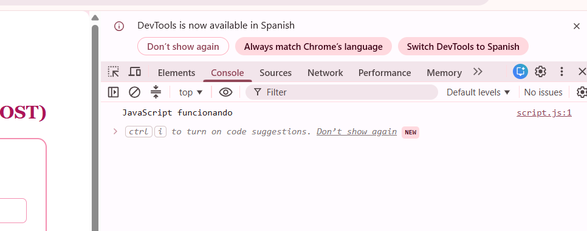
<p style="color:#c2185b; font-style:italic; font-size:13px;">Primer mensaje en consola</p>
<br>
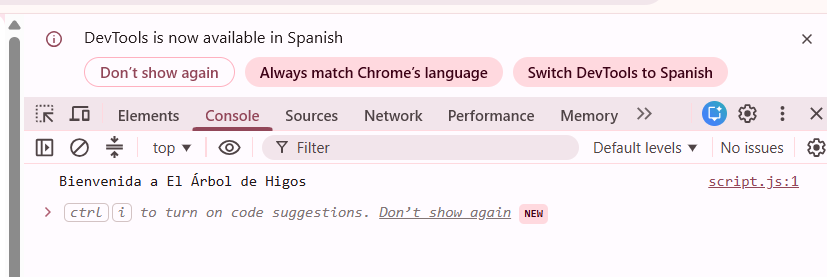
<p style="color:#c2185b; font-style:italic; font-size:13px;">Mensaje modificado en script.js</p>
<br>
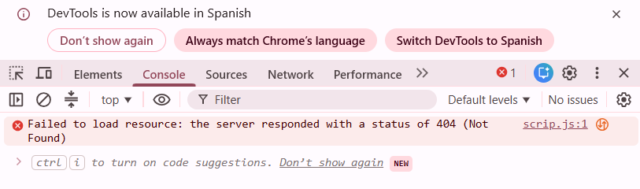
<p style="color:#c2185b; font-style:italic; font-size:13px;">Error 404 al escribir mal el nombre del archivo</p>
</div>

<br>

<h2 style="color:#c2185b; border-bottom: 3px solid #f48fb1; padding-bottom: 6px;">🌺💐💐Variables</h2>

<blockquote style="border-left: 4px solid #f48fb1; background:#fff0f5; padding: 10px 15px; color:#333;">
En JavaScript declaré variables usando <code>let</code>:
</blockquote>

```javascript
let autor = "Sylvia Plath";
let calificacion = 5;
let disponible = true;
```

<blockquote style="border-left: 4px solid #f48fb1; background:#fff0f5; padding: 10px 15px; color:#333;">
<code>autor</code> es un string (texto), <code>calificacion</code> es un número, y <code>disponible</code> es un boolean (verdadero/falso). A diferencia de PHP, en JavaScript no se distingue entre integer y float — todos los números son del mismo tipo.
</blockquote>

<div align="center">
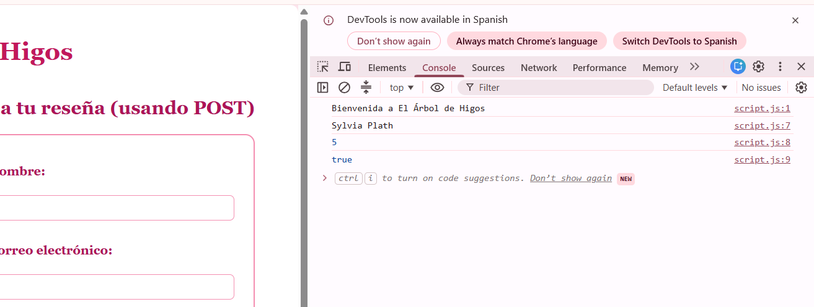
<p style="color:#c2185b; font-style:italic; font-size:13px;">Variables mostradas en la consola</p>
</div>

<br>

<h2 style="color:#c2185b; border-bottom: 3px solid #f48fb1; padding-bottom: 6px;">💕💐💐💐Funciones</h2>

<blockquote style="border-left: 4px solid #f48fb1; background:#fff0f5; padding: 10px 15px; color:#333;">
Creé una función relacionada con mi proyecto:
</blockquote>

```javascript
function mostrarBienvenida() {
    alert("Bienvenida a El Árbol de Higos");
}
```

<blockquote style="border-left: 4px solid #f48fb1; background:#fff0f5; padding: 10px 15px; color:#333;">
Una función agrupa instrucciones bajo un nombre, que se pueden ejecutar cuando se necesiten, en vez de repetir el código cada vez.
</blockquote>

<div align="center">
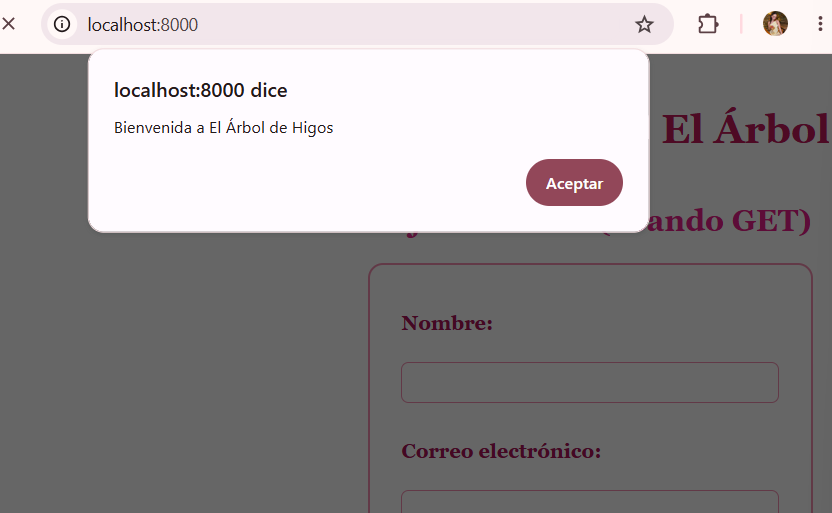
<p style="color:#c2185b; font-style:italic; font-size:13px;">Función ejecutada mostrando un alert</p>
</div>

<br>

<h2 style="color:#c2185b; border-bottom: 3px solid #f48fb1; padding-bottom: 6px;">🌸🌷🌷💐 Eventos</h2>

<blockquote style="border-left: 4px solid #f48fb1; background:#fff0f5; padding: 10px 15px; color:#333;">
Un evento es una acción del usuario (clic, envío de formulario) que JavaScript puede "escuchar" y responder. Creé un botón "Saludar" que muestra un mensaje al hacer clic:
</blockquote>

```javascript
document.getElementById("btnSaludar").addEventListener("click", function() {
    alert("Bienvenida a El Árbol de Higos, ¡gracias por visitarnos!");
});
```

<blockquote style="border-left: 4px solid #f48fb1; background:#fff0f5; padding: 10px 15px; color:#333;">
También comprobé qué pasa cuando el <code>id</code> del botón en el HTML no coincide con el que busca JavaScript: el botón sigue visible, pero deja de responder al clic, sin mostrar ningún error explícito.
</blockquote>

<div align="center">
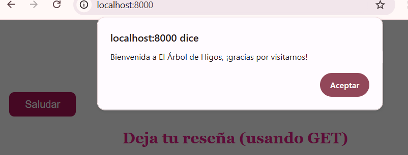
<p style="color:#c2185b; font-style:italic; font-size:13px;">Evento click funcionando</p>
<br>
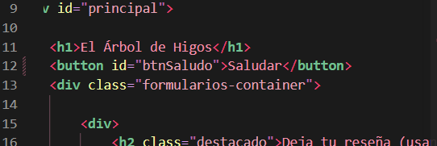
<p style="color:#c2185b; font-style:italic; font-size:13px;">Botón sin responder al cambiar el id</p>
</div>

<br>

<h2 style="color:#c2185b; border-bottom: 3px solid #f48fb1; padding-bottom: 6px;">💐 💐💐DOM</h2>

<blockquote style="border-left: 4px solid #f48fb1; background:#fff0f5; padding: 10px 15px; color:#333;">
El DOM es la forma en que el navegador representa la página HTML como una estructura que JavaScript puede leer y modificar. Usé <code>getElementById()</code> para seleccionar mi título, y <code>textContent</code> para cambiar su texto al hacer clic sobre él:
</blockquote>

```javascript
document.getElementById("titulo").addEventListener("click", function() {
    document.getElementById("titulo").textContent = "¡Bienvenida, lectora!";
});
```

<div align="center">

<p style="color:#c2185b; font-style:italic; font-size:13px;">Título modificado desde JavaScript</p>
</div>

<br>

<h2 style="color:#c2185b; border-bottom: 3px solid #f48fb1; padding-bottom: 6px;">🌷💐💐 Manipulación de elementos</h2>

<blockquote style="border-left: 4px solid #f48fb1; background:#fff0f5; padding: 10px 15px; color:#333;">
Además de cambiar el texto, agregué una clase CSS dinámicamente con <code>classList.add()</code>, para que el título también cambiara de tamaño y color al hacer clic:
</blockquote>

```javascript
document.getElementById("titulo").classList.add("titulo-clickeado");
```

<blockquote style="border-left: 4px solid #f48fb1; background:#fff0f5; padding: 10px 15px; color:#333;">
La apariencia (color, tamaño) sigue definida en <code>estilos.css</code>; JavaScript solo decide en qué momento activarla, respetando que la presentación es responsabilidad de CSS.
</blockquote>

<div align="center">
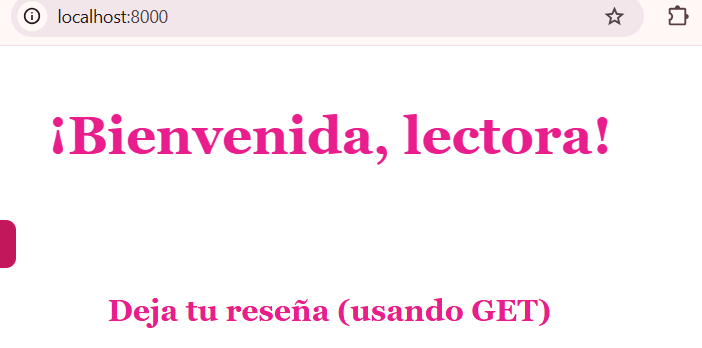
<p style="color:#c2185b; font-style:italic; font-size:13px;">Clase CSS agregada dinámicamente</p>
</div>

<br>

<h2 style="color:#c2185b; border-bottom: 3px solid #f48fb1; padding-bottom: 6px;">💕💐Validación del formulario</h2>

<blockquote style="border-left: 4px solid #f48fb1; background:#fff0f5; padding: 10px 15px; color:#333;">
Validé mi formulario de reseñas (método GET) con JavaScript, comprobando campos obligatorios y el rango de la calificación:
</blockquote>

```javascript
document.getElementById("formularioGET").addEventListener("submit", function(event) {
    let nombre = document.getElementById("nombre").value;
    if (nombre === "") {
        event.preventDefault();
        mensaje.textContent = "El nombre es obligatorio";
        mensaje.classList.add("mensaje-error");
        return;
    }
    // ... más validaciones (correo, calificación, libro, comentario)
});
```

<blockquote style="border-left: 4px solid #f48fb1; background:#fff0f5; padding: 10px 15px; color:#333;">
<code>event.preventDefault()</code> detiene el envío del formulario cuando hay un error, evitando que la información llegue al servidor. Cuando el formulario está completo y correcto, sí se envía normalmente a <code>procesar.php</code>, donde PHP también lo valida.
</blockquote>

<div align="center">
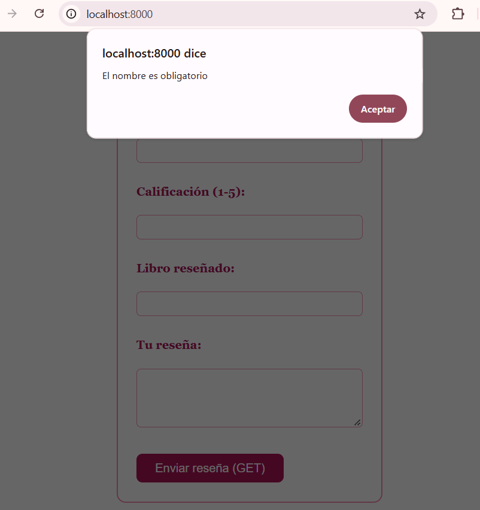
<p style="color:#c2185b; font-style:italic; font-size:13px;">Validación bloqueando el envío (nombre vacío)</p>
<br>
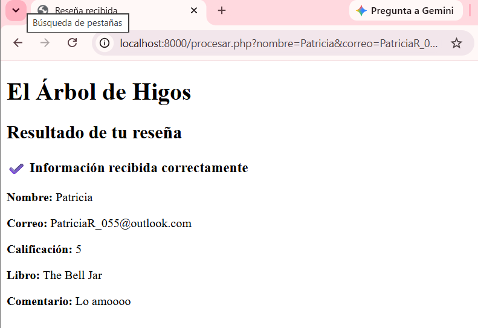
<p style="color:#c2185b; font-style:italic; font-size:13px;">Formulario válido, enviado correctamente a PHP</p>
</div>

<br>

<h3 style="color:#ad1457;">JavaScript no reemplaza a PHP</h3>

<blockquote style="border-left: 4px solid #f48fb1; background:#fff0f5; padding: 10px 15px; color:#333;">
Comprobé esto desactivando JavaScript en la configuración del navegador (<code>chrome://settings/content/javascript</code>). Al enviar el formulario vacío, ningún mensaje de JavaScript apareció, pero el formulario se envió directo a PHP, y PHP <b>sí</b> detectó los errores por su cuenta, mostrando sus propios mensajes de validación. Esto confirma que JavaScript puede fallar o desactivarse, pero PHP sigue protegiendo la aplicación de todas formas.
</blockquote>

<div align="center">
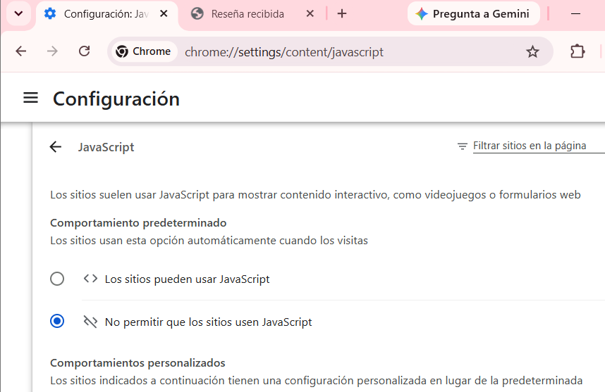
<p style="color:#c2185b; font-style:italic; font-size:13px;">JavaScript desactivado en la configuración de Chrome</p>
<br>
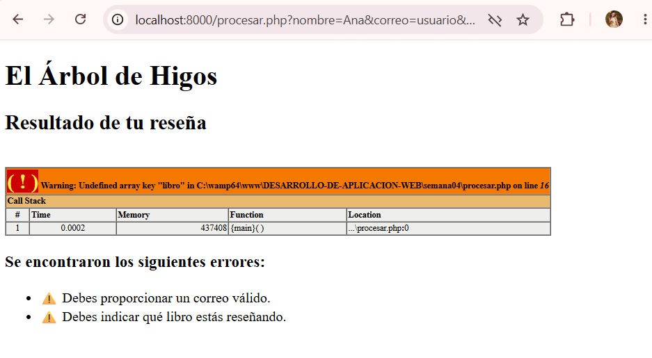
<p style="color:#c2185b; font-style:italic; font-size:13px;">PHP validando por su cuenta, sin ayuda de JavaScript</p>
</div>

<br>

<h2 style="color:#c2185b; border-bottom: 3px solid #f48fb1; padding-bottom: 6px;">🌸💐💐Mensajes dinámicos</h2>

<blockquote style="border-left: 4px solid #f48fb1; background:#fff0f5; padding: 10px 15px; color:#333;">
En vez de usar únicamente <code>alert()</code>, creé un espacio <code>&lt;div id="mensajeGET"&gt;&lt;/div&gt;</code> dentro de la página, y usé <code>textContent</code> junto con <code>classList.add("mensaje-error")</code> para mostrar los errores directamente en la interfaz, con un estilo visual acorde a mi proyecto (fondo rosa claro, texto rojo, borde).
</blockquote>

<div align="center">
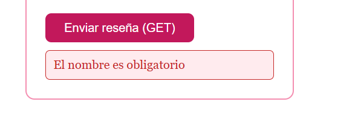
<p style="color:#c2185b; font-style:italic; font-size:13px;">Mensaje de error dentro de la página</p>
</div>

<br>

<h2 style="color:#c2185b; border-bottom: 3px solid #f48fb1; padding-bottom: 6px;">💐💐v💐💐💐 Mostrar y ocultar elementos</h2>

<blockquote style="border-left: 4px solid #f48fb1; background:#fff0f5; padding: 10px 15px; color:#333;">
Agregué un botón "Mostrar / Ocultar información" que alterna la visibilidad de una sección sobre mi tienda, usando <code>style.display</code>:
</blockquote>

```javascript
document.getElementById("btnInfo").addEventListener("click", function() {
    let info = document.getElementById("informacion");
    if (info.style.display === "none") {
        info.style.display = "block";
    } else {
        info.style.display = "none";
    }
});
```

<div align="center">
<table style="width:100%;">
<tr>
<td align="center" width="50%">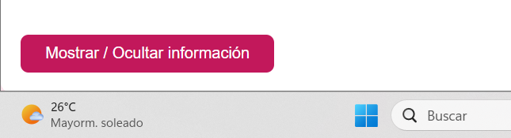<p style="font-size:12px; color:#c2185b;">Información oculta</p></td>
<td align="center" width="50%">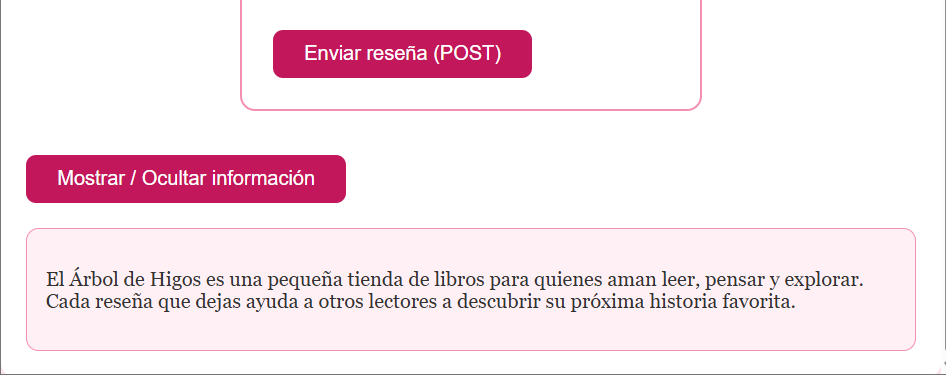<p style="font-size:12px; color:#c2185b;">Información visible</p></td>
</tr>
</table>
</div>

<br>

<h2 style="color:#c2185b; border-bottom: 3px solid #f48fb1; padding-bottom: 6px;">💕💐💐💐💐 Herramientas de desarrollador</h2>

<blockquote style="border-left: 4px solid #f48fb1; background:#fff0f5; padding: 10px 15px; color:#333;">
Usé principalmente las pestañas <b>Console</b> y <b>Elements</b>. En Console encontré mis mensajes de <code>console.log()</code> y los errores de JavaScript marcados en rojo. En Elements pude confirmar la estructura HTML, los <code>id</code> y clases de cada elemento. También descubrí que se puede editar HTML temporalmente desde ahí, aunque esos cambios no permanecen al recargar la página.
</blockquote>

<br>

<h2 style="color:#c2185b; border-bottom: 3px solid #f48fb1; padding-bottom: 6px;">🌷💐💐 Experimentos realizados</h2>

<blockquote style="border-left: 4px solid #f48fb1; background:#fff0f5; padding: 10px 15px; color:#333;">
<b>Romper JavaScript:</b> quité una llave de cierre <code>}</code> en la función del evento del título. Apareció el error <code>Uncaught SyntaxError: Unexpected end of input</code> en la consola, porque JavaScript llegó al final del archivo esperando más llaves de cierre que nunca encontró.
<br><br>
<b>Cambiar un id:</b> cambié el id del botón "Saludar" en el HTML sin tocar el JavaScript. El botón siguió visible pero dejó de responder al clic, sin mostrar ningún error explícito — JavaScript simplemente no encontró ninguna coincidencia con el id que buscaba.
</blockquote>

<div align="center">
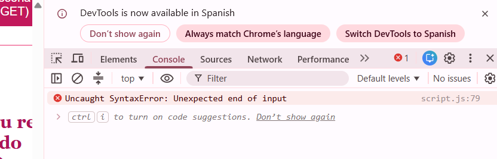
<p style="color:#a33a2e; font-style:italic; font-size:13px;">Error de sintaxis en JavaScript</p>
</div>

<br>

<h2 style="color:#c2185b; border-bottom: 3px solid #f48fb1; padding-bottom: 6px;">💐💐💐 Problemas encontrados</h2>

<table style="width:100%; border-collapse: collapse;">
<tr style="background-color:#fce4ec;"><td style="padding:8px;"><b>Qué ocurrió</b></td><td style="padding:8px;">Al quitar una llave de cierre en la función del título, apareció <code>Uncaught SyntaxError: Unexpected end of input</code> y toda la funcionalidad de la página dejó de responder.</td></tr>
<tr style="background-color:#ffffff;"><td style="padding:8px;"><b>Causa</b></td><td style="padding:8px;">A cada llave de apertura <code>{</code> le debe corresponder una de cierre <code>}</code>. Al faltar una, JavaScript no supo dónde terminaba la función y trató de leer todo el código siguiente como parte de ella.</td></tr>
<tr style="background-color:#fce4ec;"><td style="padding:8px;"><b>Otro problema</b></td><td style="padding:8px;">Al desactivar JavaScript y enviar el formulario vacío, apareció un warning en PHP: <code>Undefined array key "libro"</code>.</td></tr>
<tr style="background-color:#ffffff;"><td style="padding:8px;"><b>Causa</b></td><td style="padding:8px;">PHP intentaba acceder a un dato que no llegó en la solicitud, porque el campo no existía en ese envío.</td></tr>
</table>

<br>

<h2 style="color:#c2185b; border-bottom: 3px solid #f48fb1; padding-bottom: 6px;">🌸💐💐💐 Errores de JavaScript</h2>

<blockquote style="border-left: 4px solid #f48fb1; background:#fff0f5; padding: 10px 15px; color:#333;">
El error <code>SyntaxError</code> que provoqué es distinto a los errores de PHP en cómo se muestran: en JavaScript, el error aparece únicamente en la consola del navegador (no interrumpe visualmente la página con un mensaje como en PHP), lo cual significa que si no reviso la consola, podría no darme cuenta de inmediato de que algo está fallando.
</blockquote>

<br>

<h2 style="color:#c2185b; border-bottom: 3px solid #f48fb1; padding-bottom: 6px;">💕💐💐💐 Soluciones aplicadas</h2>

<blockquote style="border-left: 4px solid #f48fb1; background:#fff0f5; padding: 10px 15px; color:#333;">
Para el error de sintaxis, agregué de vuelta la llave de cierre faltante, restaurando toda la funcionalidad de la página.
<br><br>
Para el warning de PHP, utilicé <code>isset()</code> para comprobar si cada dato existía antes de intentar usarlo, asignando un valor vacío por defecto cuando no llegaba, evitando así el aviso.
</blockquote>

<br>

<h2 style="color:#c2185b; border-bottom: 3px solid #f48fb1; padding-bottom: 6px;">💐💐💐💐💐💐 Investigación</h2>

<blockquote style="border-left: 4px solid #f48fb1; background:#fff0f5; padding: 10px 15px; color:#333;">
<b>JavaScript:</b> lenguaje que se ejecuta en el navegador, permitiendo que una página responda a las acciones del usuario sin recargar.
<br><br>
<b>Variable:</b> espacio donde se guarda un valor; en JavaScript se declara con <code>let</code>.
<br><br>
<b>Función:</b> bloque de instrucciones agrupadas bajo un nombre, ejecutable cuando se necesite.
<br><br>
<b>Evento:</b> acción del usuario (clic, envío de formulario) que JavaScript puede escuchar y responder.
<br><br>
<b>DOM:</b> representación de la página HTML como estructura que JavaScript puede leer y modificar.
<br><br>
<b>getElementById():</b> selecciona un elemento HTML por su id.
<br><br>
<b>querySelector():</b> selecciona un elemento usando un selector CSS.
<br><br>
<b>addEventListener():</b> conecta un evento a un elemento, ejecutando una función cuando ocurre.
<br><br>
<b>textContent:</b> lee o cambia el texto visible de un elemento.
<br><br>
<b>classList:</b> permite agregar o quitar clases CSS dinámicamente.
<br><br>
<b>preventDefault():</b> detiene el comportamiento normal de un evento, como el envío de un formulario.
<br><br>
<b>Validación del lado del cliente:</b> validación que hace JavaScript en el navegador, antes de enviar los datos.
<br><br>
<b>¿Por qué validar también en PHP?</b> Porque JavaScript puede desactivarse; PHP es la validación real que protege la aplicación.
</blockquote>

<br>

<h2 style="color:#c2185b; border-bottom: 3px solid #f48fb1; padding-bottom: 6px;">🌷💐💐💐💐 Relación entre HTML, CSS, JavaScript y PHP</h2>

<blockquote style="border-left: 4px solid #f48fb1; background:#fff0f5; padding: 10px 15px; color:#333;">
PHP genera el HTML en el servidor. Ese HTML llega al navegador junto con las etiquetas que vinculan CSS y JavaScript. CSS le da apariencia a la estructura. JavaScript agrega comportamiento: valida el formulario antes de enviarlo, cambia contenido y estilos dinámicamente. Si JavaScript aprueba los datos, el formulario se envía de nuevo al servidor, donde PHP los procesa y valida otra vez, generando un nuevo HTML de respuesta. Las cuatro tecnologías trabajan juntas, cada una con su propia responsabilidad.
</blockquote>

<br>

<h2 style="color:#c2185b; border-bottom: 3px solid #f48fb1; padding-bottom: 6px;">💐💐💐💐 Antes y después</h2>

<div align="center">
<table style="width:100%;">
<tr>
<td align="center" width="50%"><p style="font-size:13px; color:#c2185b;"><b>Antes</b> — Semana 03, sin interacción</p></td>
<td align="center" width="50%"><p style="font-size:13px; color:#c2185b;"><b>Después</b> — Semana 04, con JavaScript</p></td>
</tr>
</table>
</div>

<br>

<h2 style="color:#c2185b; border-bottom: 3px solid #f48fb1; padding-bottom: 6px;">🌸💐💐💐 Reflexión final</h2>

<blockquote style="border-left: 4px solid #f48fb1; background:#fff0f5; padding: 10px 15px; color:#333;">
Esta semana entendí que JavaScript le da vida a una página: la hace responder de inmediato a lo que hace el usuario, sin depender de recargar o esperar al servidor. Pero también aprendí algo muy importante: JavaScript nunca debe ser la única línea de defensa de una aplicación, porque puede desactivarse o evitarse. Lo comprobé yo misma al desactivarlo y ver que PHP seguía validando todo correctamente. Ahora entiendo mejor cómo HTML, CSS, JavaScript y PHP trabajan juntos, cada uno con una responsabilidad clara: estructura, presentación, interacción y procesamiento. Mi tienda "El Árbol de Higos" ya no solo se ve bien, ahora también responde.
</blockquote>

<br>