<table style="width:100%; border:none; margin-bottom:20px;">
<tr>
<td width="120" align="center" style="border:none;">

</td>
<td align="right" style="border:none; padding: 20px 10px;">
<h1 style="color:#c2185b; font-family: Georgia, serif; letter-spacing: 2px; margin-bottom:5px;">💐💐💐 EL ÁRBOL DE HIGOS 💐💐💐</h1>
<p style="color:#ad1457; font-style: italic; font-size: 15px; margin:0;">Semana 05 — PHP + MySQL: la aplicación empieza a recordar</p>
<p style="color:#e91e8c; font-size: 13px; margin:0;">Desarrollo de Aplicaciones Web</p>
</td>
</tr>
</table>

<br>

<table style="width:100%; border-collapse: collapse;">
<tr style="background-color:#c2185b; color:#ffffff;">
<td style="padding:8px;"><b>Alumna</b></td>
<td style="padding:8px;">Patricia Segura Resendiz</td>
</tr>
<tr style="background-color:#fce4ec;">
<td style="padding:8px;"><b>Institución</b></td>
<td style="padding:8px;">Instituto Tecnológico Superior de Rioverde</td>
</tr>
<tr style="background-color:#c2185b; color:#ffffff;">
<td style="padding:8px;"><b>Carrera</b></td>
<td style="padding:8px;">Ingeniería en Sistemas Computacionales</td>
</tr>
<tr style="background-color:#fce4ec;">
<td style="padding:8px;"><b>Docente</b></td>
<td style="padding:8px;">Ing. José de Jesús Collazo Reyes</td>
</tr>
<tr style="background-color:#c2185b; color:#ffffff;">
<td style="padding:8px;"><b>Entorno</b></td>
<td style="padding:8px;">WampServer · Apache 2.4.59 · PHP 8.2.18 · MySQL 8.0.42</td>
</tr>
</table>

<br>

<h2 style="color:#c2185b; border-bottom: 3px solid #f48fb1; padding-bottom: 6px;">🌸🌸🌸💐 Objetivo</h2>

<blockquote style="border-left: 4px solid #f48fb1; background:#fff0f5; padding: 10px 15px; color:#333;">
Aprendí a crear una base de datos en MySQL, conectarla con PHP, guardar información real enviada desde mi formulario de reseñas, y consultar esa información para mostrarla dinámicamente en una tabla HTML. También comprendí la diferencia entre información temporal (como una variable de PHP) y permanente (como un registro de MySQL), y experimenté directamente con INSERT, SELECT, UPDATE, DELETE y ALTER TABLE.
</blockquote>

<br>

<h2 style="color:#c2185b; border-bottom: 3px solid #f48fb1; padding-bottom: 6px;">🌷💗💗💐 Aplicación web </h2>

<blockquote style="border-left: 4px solid #f48fb1; background:#fff0f5; padding: 10px 15px; color:#333;">
Esta semana mi tienda "El Árbol de Higos" dejó de perder la información cada vez que se recargaba la página. Ahora, cuando un lector deja una reseña, esta se guarda de forma permanente en una base de datos MySQL, y puede consultarse en cualquier momento desde una página dedicada a mostrar todas las reseñas recibidas.
</blockquote>

<br>

<h2 style="color:#c2185b; border-bottom: 3px solid #f48fb1; padding-bottom: 6px;">💗💗💗💐 Base de datos</h2>

<blockquote style="border-left: 4px solid #f48fb1; background:#fff0f5; padding: 10px 15px; color:#333;">
Una base de datos es un sistema organizado para almacenar información de manera permanente. Verifiqué primero que MySQL estuviera disponible en mi instalación de WampServer:
</blockquote>

```bash
/c/wamp64/bin/mysql/mysql8.3.0/bin/mysql.exe --version
```

<div align="center">
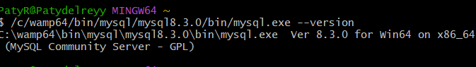
<p style="color:#c2185b; font-style:italic; font-size:13px;">Versión de MySQL verificada</p>
<br>
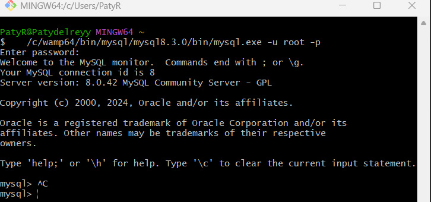
<p style="color:#c2185b; font-style:italic; font-size:13px;">Conexión a MySQL desde la terminal</p>
<br>
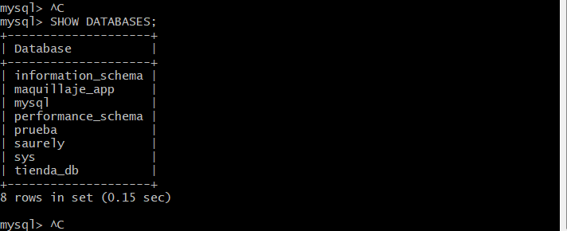
<p style="color:#c2185b; font-style:italic; font-size:13px;">Bases de datos disponibles en el servidor</p>
</div>

<br>

<h2 style="color:#c2185b; border-bottom: 3px solid #f48fb1; padding-bottom: 6px;">🌺💗💗💐 Nombre de la base de datos</h2>

<blockquote style="border-left: 4px solid #f48fb1; background:#fff0f5; padding: 10px 15px; color:#333;">
Mi base de datos se llama <code>arbol_de_higos</code>, relacionada directamente con el nombre de mi proyecto:
</blockquote>

```sql
CREATE DATABASE arbol_de_higos;
USE arbol_de_higos;
```

<div align="center">
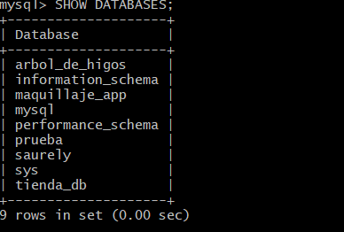
<p style="color:#c2185b; font-style:italic; font-size:13px;">Base de datos arbol_de_higos creada</p>
</div>

<br>

<h2 style="color:#c2185b; border-bottom: 3px solid #f48fb1; padding-bottom: 6px;">💕💗💗💗💐Tabla principal</h2>

<blockquote style="border-left: 4px solid #f48fb1; background:#fff0f5; padding: 10px 15px; color:#333;">
Creé la tabla <code>resenas</code>, que almacena las reseñas que los lectores dejan sobre los libros de la tienda:
</blockquote>

```sql
CREATE TABLE resenas (
    id INT AUTO_INCREMENT PRIMARY KEY,
    nombre VARCHAR(100) NOT NULL,
    correo VARCHAR(150),
    libro VARCHAR(150) NOT NULL,
    calificacion INT,
    comentario TEXT
);
```

<div align="center">
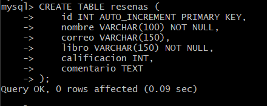
<p style="color:#c2185b; font-style:italic; font-size:13px;">Tabla resenas creada</p>
<br>
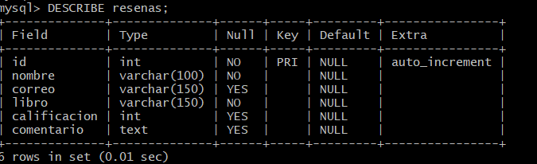
<p style="color:#c2185b; font-style:italic; font-size:13px;">Estructura de la tabla (DESCRIBE)</p>
</div>

<br>

<h2 style="color:#c2185b; border-bottom: 3px solid #f48fb1; padding-bottom: 6px;">🌸💗💗💐 Campos de la tabla</h2>

<table style="width:100%; border-collapse: collapse;">
<tr style="background-color:#c2185b; color:#ffffff;">
<th style="padding:8px; text-align:left;">Campo</th>
<th style="padding:8px; text-align:left;">Tipo</th>
<th style="padding:8px; text-align:left;">Null</th>
<th style="padding:8px; text-align:left;">Llave</th>
</tr>
<tr style="background-color:#fce4ec;"><td style="padding:8px;"><code>id</code></td><td style="padding:8px;">INT</td><td style="padding:8px;">NO</td><td style="padding:8px;">PRI (AUTO_INCREMENT)</td></tr>
<tr style="background-color:#ffffff;"><td style="padding:8px;"><code>nombre</code></td><td style="padding:8px;">VARCHAR(100)</td><td style="padding:8px;">NO</td><td style="padding:8px;">—</td></tr>
<tr style="background-color:#fce4ec;"><td style="padding:8px;"><code>correo</code></td><td style="padding:8px;">VARCHAR(150)</td><td style="padding:8px;">SÍ</td><td style="padding:8px;">—</td></tr>
<tr style="background-color:#ffffff;"><td style="padding:8px;"><code>libro</code></td><td style="padding:8px;">VARCHAR(150)</td><td style="padding:8px;">NO</td><td style="padding:8px;">—</td></tr>
<tr style="background-color:#fce4ec;"><td style="padding:8px;"><code>calificacion</code></td><td style="padding:8px;">INT</td><td style="padding:8px;">SÍ</td><td style="padding:8px;">—</td></tr>
<tr style="background-color:#ffffff;"><td style="padding:8px;"><code>comentario</code></td><td style="padding:8px;">TEXT</td><td style="padding:8px;">SÍ</td><td style="padding:8px;">—</td></tr>
<tr style="background-color:#fce4ec;"><td style="padding:8px;"><code>fecha</code></td><td style="padding:8px;">DATE</td><td style="padding:8px;">SÍ</td><td style="padding:8px;">—</td></tr>
</table>

<br>

<h2 style="color:#c2185b; border-bottom: 3px solid #f48fb1; padding-bottom: 6px;">💐💐💐💐 Llave primaria</h2>

<blockquote style="border-left: 4px solid #f48fb1; background:#fff0f5; padding: 10px 15px; color:#333;">
La llave primaria de mi tabla es <code>id</code>. Identifica de manera única cada reseña, sin que dos registros puedan tener el mismo id, lo que permite modificar o eliminar un registro específico con total precisión (como hice en mis experimentos de UPDATE y DELETE).
</blockquote>

<br>

<h2 style="color:#c2185b; border-bottom: 3px solid #f48fb1; padding-bottom: 6px;">🌷🌷🌷 Tipos de datos</h2>

<blockquote style="border-left: 4px solid #f48fb1; background:#fff0f5; padding: 10px 15px; color:#333;">
Usé <code>INT</code> para números enteros (id, calificación), <code>VARCHAR</code> para texto corto con un límite de caracteres (nombre, correo, libro), <code>TEXT</code> para texto largo sin un límite tan corto (comentario), y <code>DATE</code> para fechas (agregado después con ALTER TABLE).
</blockquote>

<br>

<h2 style="color:#c2185b; border-bottom: 3px solid #f48fb1; padding-bottom: 6px;">💕🌷🌷🌷 AUTO_INCREMENT</h2>

<blockquote style="border-left: 4px solid #f48fb1; background:#fff0f5; padding: 10px 15px; color:#333;">
Con <code>AUTO_INCREMENT</code> en el campo <code>id</code>, MySQL genera automáticamente el siguiente número cada vez que inserto una reseña nueva, sin que yo tenga que calcularlo manualmente. Lo comprobé al insertar varios registros: 1, 2, 3, y así sucesivamente.
</blockquote>

<br>

<h2 style="color:#c2185b; border-bottom: 3px solid #f48fb1; padding-bottom: 6px;">🌺🌷🌷 Comandos SQL utilizados</h2>

<table style="width:100%; border-collapse: collapse;">
<tr style="background-color:#c2185b; color:#ffffff;"><th style="padding:8px; text-align:left;">Comando</th><th style="padding:8px; text-align:left;">Función</th></tr>
<tr style="background-color:#fce4ec;"><td style="padding:8px;"><code>CREATE DATABASE</code></td><td style="padding:8px;">Crear la base de datos</td></tr>
<tr style="background-color:#ffffff;"><td style="padding:8px;"><code>USE</code></td><td style="padding:8px;">Seleccionar la base de datos a usar</td></tr>
<tr style="background-color:#fce4ec;"><td style="padding:8px;"><code>CREATE TABLE</code></td><td style="padding:8px;">Crear la tabla</td></tr>
<tr style="background-color:#ffffff;"><td style="padding:8px;"><code>DESCRIBE</code></td><td style="padding:8px;">Ver la estructura de la tabla</td></tr>
<tr style="background-color:#fce4ec;"><td style="padding:8px;"><code>INSERT</code></td><td style="padding:8px;">Guardar un registro</td></tr>
<tr style="background-color:#ffffff;"><td style="padding:8px;"><code>SELECT</code></td><td style="padding:8px;">Consultar registros</td></tr>
<tr style="background-color:#fce4ec;"><td style="padding:8px;"><code>UPDATE</code></td><td style="padding:8px;">Modificar un registro</td></tr>
<tr style="background-color:#ffffff;"><td style="padding:8px;"><code>DELETE</code></td><td style="padding:8px;">Eliminar un registro</td></tr>
<tr style="background-color:#fce4ec;"><td style="padding:8px;"><code>ALTER TABLE</code></td><td style="padding:8px;">Modificar la estructura de la tabla</td></tr>
</table>

<p style="color:#c2185b; font-size:13px;">Todo el código SQL utilizado está documentado en el archivo <code>consultas.sql</code>.</p>

<br>

<h2 style="color:#c2185b; border-bottom: 3px solid #f48fb1; padding-bottom: 6px;">💐🌷🌷🌷 INSERT</h2>

```sql
INSERT INTO resenas (nombre, correo, libro, calificacion, comentario)
VALUES ('Patricia', 'patricia@test.com', 'The Bell Jar', 5, 'Un libro que te marca para siempre.');
```

<div align="center">
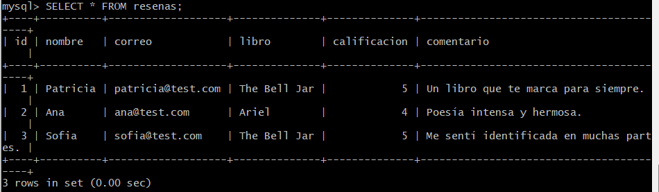
<p style="color:#c2185b; font-style:italic; font-size:13px;">Registros de prueba insertados</p>
<br>
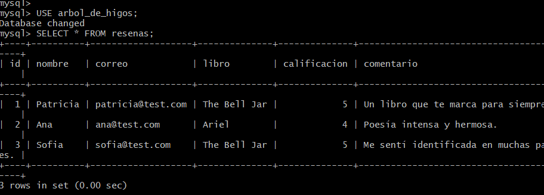
<p style="color:#c2185b; font-style:italic; font-size:13px;">Comprobación de persistencia: los datos siguen ahí tras salir y volver a entrar a MySQL</p>
</div>

<br>

<h2 style="color:#c2185b; border-bottom: 3px solid #f48fb1; padding-bottom: 6px;">🌸🌷🌷 SELECT</h2>

```sql
SELECT * FROM resenas;
SELECT * FROM resenas ORDER BY calificacion DESC;
```

<blockquote style="border-left: 4px solid #f48fb1; background:#fff0f5; padding: 10px 15px; color:#333;">
Usé <code>SELECT *</code> para traer todos los campos de todos los registros, y agregué <code>ORDER BY calificacion DESC</code> como parte de mi desafío de la semana, para mostrar primero las reseñas mejor calificadas.
</blockquote>

<br>

<h2 style="color:#c2185b; border-bottom: 3px solid #f48fb1; padding-bottom: 6px;">💕🌷🌷🌷Conexión PHP + MySQL</h2>

<blockquote style="border-left: 4px solid #f48fb1; background:#fff0f5; padding: 10px 15px; color:#333;">
Usé la extensión <code>mysqli</code> de PHP para conectar con la base de datos. La conexión necesita el servidor, el usuario, la contraseña y el nombre de la base de datos.
</blockquote>

<div align="center">
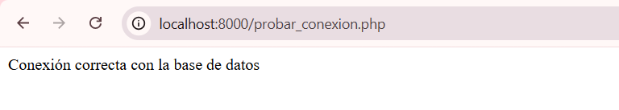
<p style="color:#c2185b; font-style:italic; font-size:13px;">Conexión exitosa entre PHP y MySQL</p>
</div>

<br>

<h2 style="color:#c2185b; border-bottom: 3px solid #f48fb1; padding-bottom: 6px;">🌷🌷🌷🌷 Archivo conexion.php</h2>

```php
<?php
    $conexion = new mysqli(
        "localhost",
        "root",
        "",
        "arbol_de_higos"
    );

    if ($conexion->connect_error) {
        die("Error de conexión: " . $conexion->connect_error);
    }
?>
```

<blockquote style="border-left: 4px solid #f48fb1; background:#fff0f5; padding: 10px 15px; color:#333;">
Separé la conexión en su propio archivo para no repetir este código en cada página. <code>index.php</code> se encarga de mostrar la interfaz, <code>procesar.php</code> de procesar y guardar la información, y <code>resenas.php</code> de consultarla y mostrarla — todos usan <code>require_once "conexion.php";</code> cuando necesitan hablar con la base de datos.
</blockquote>

<br>

<h3 style="color:#ad1457;">Experimento — Error de conexión</h3>

<table style="width:100%; border-collapse: collapse;">
<tr style="background-color:#fce4ec;"><td style="padding:8px;"><b>Problema</b></td><td style="padding:8px;">Cambié el nombre de la base de datos en <code>conexion.php</code> a <code>"base_incorrecta"</code>.</td></tr>
<tr style="background-color:#ffffff;"><td style="padding:8px;"><b>Error mostrado</b></td><td style="padding:8px;"><code>mysqli_sql_exception: Unknown database 'base_incorrecta'</code></td></tr>
<tr style="background-color:#fce4ec;"><td style="padding:8px;"><b>Causa</b></td><td style="padding:8px;">MySQL no encontró ninguna base de datos con ese nombre exacto.</td></tr>
<tr style="background-color:#ffffff;"><td style="padding:8px;"><b>Solución</b></td><td style="padding:8px;">Corregí el nombre de vuelta a <code>"arbol_de_higos"</code>, restaurando la conexión.</td></tr>
</table>

<div align="center">
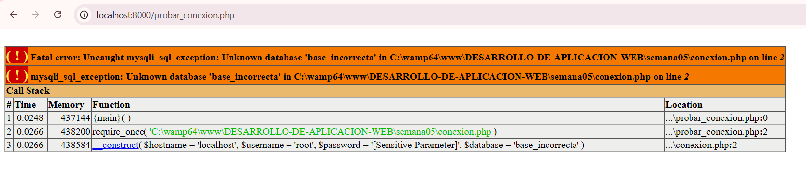
<p style="color:#a33a2e; font-style:italic; font-size:13px;">Error de conexión provocado intencionalmente</p>
</div>

<br>

<h2 style="color:#c2185b; border-bottom: 3px solid #f48fb1; padding-bottom: 6px;">💐🌷🌷 Formulario</h2>

<blockquote style="border-left: 4px solid #f48fb1; background:#fff0f5; padding: 10px 15px; color:#333;">
Reutilicé el formulario de reseñas construido en la Semana 02 (y estilizado en la Semana 03, validado en la Semana 04), sin cambiar su estructura HTML. Lo único nuevo es que ahora, al enviarse, la información no solo se muestra: se guarda de forma permanente.
</blockquote>

<br>

<h2 style="color:#c2185b; border-bottom: 3px solid #f48fb1; padding-bottom: 6px;">🌸🌷🌷🌷 Guardar información</h2>

```php
$sql = "INSERT INTO resenas (nombre, correo, libro, calificacion, comentario)
        VALUES ('$nombre', '$correo', '$libro', '$calificacion', '$comentario')";

if ($conexion->query($sql)) {
    echo "Reseña guardada correctamente en la base de datos";
}
```

<div align="center">
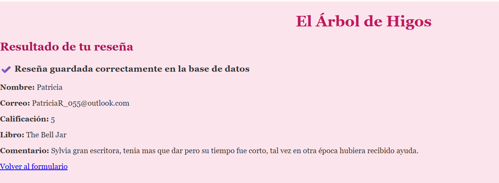
<p style="color:#c2185b; font-style:italic; font-size:13px;">Reseña guardada desde el formulario real</p>
<br>
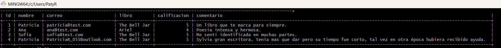
<p style="color:#c2185b; font-style:italic; font-size:13px;">Confirmación del registro directamente en MySQL</p>
</div>

<br>

<h2 style="color:#c2185b; border-bottom: 3px solid #f48fb1; padding-bottom: 6px;">💕🌷🌷 Consultar información</h2>

```php
$sql = "SELECT * FROM resenas ORDER BY calificacion DESC";
$resultado = $conexion->query($sql);

while ($fila = $resultado->fetch_assoc()) {
    echo $fila["nombre"];
}
```

<br>

<h2 style="color:#c2185b; border-bottom: 3px solid #f48fb1; padding-bottom: 6px;">🌷🌷🌷 Mostrar información</h2>

<blockquote style="border-left: 4px solid #f48fb1; background:#fff0f5; padding: 10px 15px; color:#333;">
Creé la página <code>resenas.php</code>, que recorre cada registro con un ciclo <code>while</code> y genera una fila de tabla HTML por cada reseña, usando el mismo estilo (<code>estilos.css</code>) que el resto de mi tienda.
</blockquote>

<div align="center">
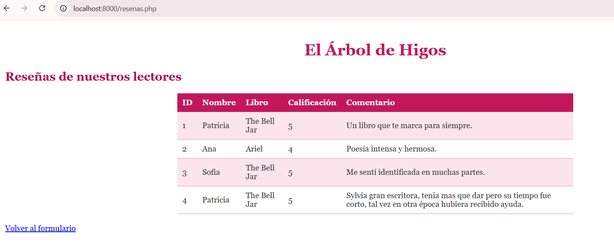
<p style="color:#c2185b; font-style:italic; font-size:13px;">Tabla de reseñas consultadas desde MySQL</p>
</div>

<br>

<h2 style="color:#c2185b; border-bottom: 3px solid #f48fb1; padding-bottom: 6px;">💐🌷🌷 Validaciones</h2>

<blockquote style="border-left: 4px solid #f48fb1; background:#fff0f5; padding: 10px 15px; color:#333;">
Mantuve las validaciones de PHP de la Semana 02 (campos obligatorios, formato de correo, rango de calificación) antes de ejecutar el <code>INSERT</code>. Solo si no hay errores, la información se guarda en MySQL — así evito guardar registros incompletos o incorrectos en la base de datos permanente.
</blockquote>

<br>

<h2 style="color:#c2185b; border-bottom: 3px solid #f48fb1; padding-bottom: 6px;">🌸🌷🌷🌷 JavaScript</h2>

<blockquote style="border-left: 4px solid #f48fb1; background:#fff0f5; padding: 10px 15px; color:#333;">
Mi validación de JavaScript de la Semana 04 sigue funcionando igual: revisa los campos antes de enviar el formulario. Esto no cambió con la llegada de MySQL — JavaScript sigue siendo responsable de la interacción inmediata con el usuario, mientras que PHP y MySQL se encargan del procesamiento y almacenamiento real.
</blockquote>

<br>

<h2 style="color:#c2185b; border-bottom: 3px solid #f48fb1; padding-bottom: 6px;">🌷🌷🌷 CSS</h2>

<blockquote style="border-left: 4px solid #f48fb1; background:#fff0f5; padding: 10px 15px; color:#333;">
Agregué estilos nuevos para la tabla de reseñas (<code>table</code>, <code>th</code>, <code>td</code>), manteniendo la misma paleta rosa de toda la tienda, para que la información consultada desde MySQL se vea igual de cuidada que el resto de la interfaz.
</blockquote>

<br>

<h2 style="color:#c2185b; border-bottom: 3px solid #f48fb1; padding-bottom: 6px;">🌷🌷🌷🌷 Experimentos realizados</h2>

<blockquote style="border-left: 4px solid #f48fb1; background:#fff0f5; padding: 10px 15px; color:#333;">
<b>Persistencia de datos:</b> salí y volví a entrar a MySQL; los registros seguían exactamente iguales.
<br><br>
<b>UPDATE desde MySQL:</b> modifiqué la calificación de un registro directamente desde la terminal, y el cambio se reflejó automáticamente en mi página <code>resenas.php</code> sin tocar ningún código PHP.
<br><br>
<b>DELETE desde MySQL:</b> eliminé un registro de prueba con <code>DELETE FROM resenas WHERE id = 1;</code>, confirmando que desapareció tanto en la terminal como en la página.
<br><br>
<b>ALTER TABLE:</b> agregué un nuevo campo <code>fecha</code> a la tabla ya existente, sin perder ninguno de los datos anteriores (que quedaron con ese campo en NULL).
</blockquote>

<div align="center">
<table style="width:100%;">
<tr>
<td align="center" width="50%">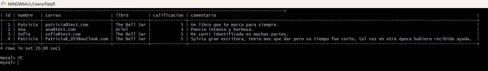<p style="font-size:12px; color:#c2185b;">UPDATE en MySQL</p></td>
<td align="center" width="50%">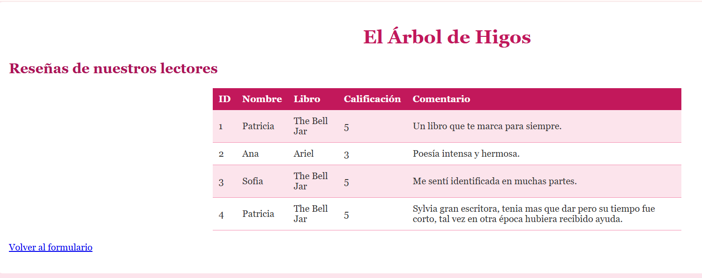<p style="font-size:12px; color:#c2185b;">Cambio reflejado en el navegador</p></td>
</tr>
<tr>
<td align="center" width="50%">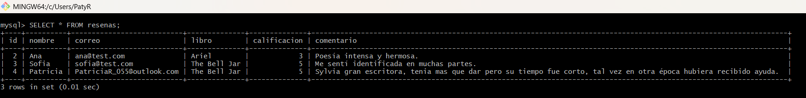<p style="font-size:12px; color:#c2185b;">DELETE en MySQL</p></td>
<td align="center" width="50%">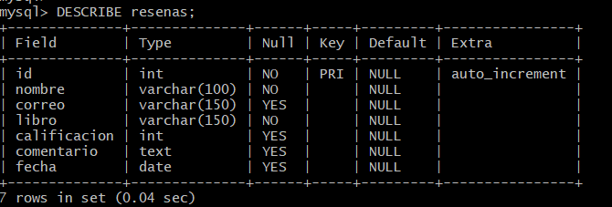<p style="font-size:12px; color:#c2185b;">ALTER TABLE — nuevo campo</p></td>
</tr>
</table>
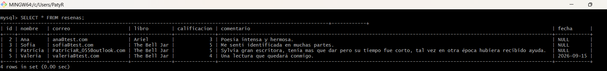
<p style="color:#c2185b; font-style:italic; font-size:13px;">Nuevo registro usando el campo fecha; los anteriores quedaron en NULL</p>
<br>
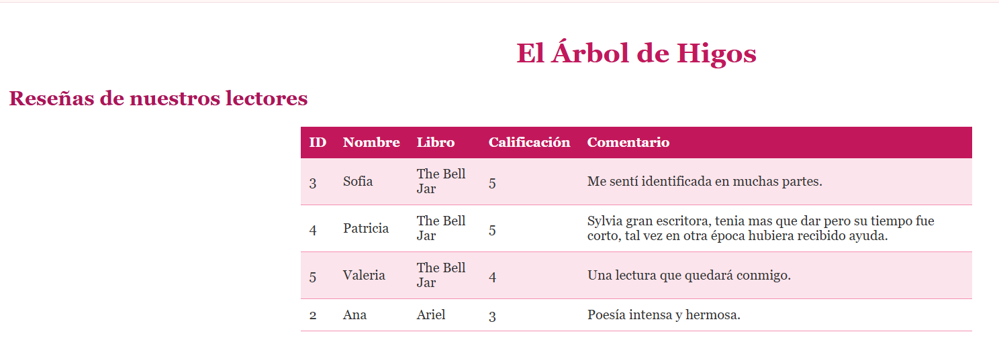
<p style="color:#c2185b; font-style:italic; font-size:13px;">Desafío: reseñas ordenadas de mayor a menor calificación</p>
</div>

<br>

<h2 style="color:#c2185b; border-bottom: 3px solid #f48fb1; padding-bottom: 6px;">💐🌷🌷🌷 Problemas encontrados</h2>

<table style="width:100%; border-collapse: collapse;">
<tr style="background-color:#fce4ec;"><td style="padding:8px;"><b>Qué ocurrió</b></td><td style="padding:8px;">Al intentar probar la conexión, apareció <code>Failed to open stream: No such file or directory</code> para <code>conexion.php</code>.</td></tr>
<tr style="background-color:#ffffff;"><td style="padding:8px;"><b>Causa</b></td><td style="padding:8px;">El archivo <code>conexion.php</code> nunca llegó a guardarse correctamente la primera vez que lo creé.</td></tr>
<tr style="background-color:#fce4ec;"><td style="padding:8px;"><b>Solución</b></td><td style="padding:8px;">Volví a crear el archivo, confirmando que se guardara (sin el punto de "cambios sin guardar" en la pestaña de VS Code), y la conexión funcionó correctamente.</td></tr>
</table>

<br>

<h2 style="color:#c2185b; border-bottom: 3px solid #f48fb1; padding-bottom: 6px;">🌸🌷🌷🌷 Errores de conexión</h2>

<blockquote style="border-left: 4px solid #f48fb1; background:#fff0f5; padding: 10px 15px; color:#333;">
El error de conexión que provoqué a propósito (<code>Unknown database</code>) mostró un mensaje muy específico, indicando exactamente el nombre de la base de datos que no pudo encontrar. Esto demuestra que MySQL, igual que PHP, da mensajes de error bastante informativos para facilitar el diagnóstico.
</blockquote>

<br>

<h2 style="color:#c2185b; border-bottom: 3px solid #f48fb1; padding-bottom: 6px;">💕🌷🌷 Soluciones aplicadas</h2>

<blockquote style="border-left: 4px solid #f48fb1; background:#fff0f5; padding: 10px 15px; color:#333;">
Para el archivo faltante, lo volví a crear y confirmé que se guardara correctamente. Para el error de conexión provocado, corregí el nombre de la base de datos de vuelta al correcto (<code>arbol_de_higos</code>), restaurando la conexión exitosa.
</blockquote>

<br>

<h2 style="color:#c2185b; border-bottom: 3px solid #f48fb1; padding-bottom: 6px;">🌷🌷🌷🌷Investigación</h2>

<blockquote style="border-left: 4px solid #f48fb1; background:#fff0f5; padding: 10px 15px; color:#333;">
<b>Base de datos:</b> sistema organizado para almacenar información de manera permanente.
<br><br>
<b>MySQL:</b> sistema gestor de bases de datos que permite crear, almacenar y consultar información mediante SQL.
<br><br>
<b>Tabla:</b> estructura que organiza información en filas y columnas dentro de una base de datos.
<br><br>
<b>Campo:</b> columna de la tabla; característica de la información (ej. nombre).
<br><br>
<b>Registro:</b> fila de la tabla; un elemento completo guardado (ej. una reseña).
<br><br>
<b>Llave primaria:</b> campo que identifica de forma única cada registro.
<br><br>
<b>AUTO_INCREMENT:</b> genera automáticamente el siguiente valor de un campo, sin especificarlo manualmente.
<br><br>
<b>VARCHAR:</b> tipo de dato para texto con longitud máxima definida.
<br><br>
<b>INT:</b> tipo de dato para números enteros.
<br><br>
<b>CREATE DATABASE / CREATE TABLE / USE / DESCRIBE / INSERT / SELECT / WHERE / UPDATE / DELETE:</b> instrucciones SQL explicadas y comprobadas en la práctica (ver tabla de comandos arriba).
<br><br>
<b>Conexión PHP-MySQL:</b> enlace que permite que un script PHP se comunique con el servidor de MySQL.
<br><br>
<b>Persistencia:</b> que los datos permanecen guardados incluso después de cerrar el navegador o reiniciar el servidor.
<br><br>
<b>¿Por qué PHP debe validar los datos?</b> Para asegurar que la información tenga sentido antes de guardarla de forma permanente en la base de datos.
</blockquote>

<br>

<h2 style="color:#c2185b; border-bottom: 3px solid #f48fb1; padding-bottom: 6px;">💐🌷🌷🌷 Relación entre PHP y MySQL</h2>

<blockquote style="border-left: 4px solid #f48fb1; background:#fff0f5; padding: 10px 15px; color:#333;">
PHP no almacena información por sí mismo; solo la procesa y se comunica con MySQL para guardarla o consultarla. MySQL es quien realmente guarda los datos de forma permanente. Lo comprobé al modificar un registro directamente desde MySQL (sin usar PHP) y ver cómo mi página reflejaba el cambio de inmediato, porque siempre consulta la información más actual.
</blockquote>

<br>

<h2 style="color:#c2185b; border-bottom: 3px solid #f48fb1; padding-bottom: 6px;">🌸🌷🌷 Relación entre JavaScript, PHP y MySQL</h2>

<blockquote style="border-left: 4px solid #f48fb1; background:#fff0f5; padding: 10px 15px; color:#333;">
JavaScript valida la información en el navegador, de forma inmediata, antes de que el formulario se envíe. PHP recibe esa información en el servidor, la valida nuevamente (por si JavaScript fue evitado o desactivado), y solo si todo es correcto, la envía a MySQL para guardarla permanentemente. Las tres tecnologías trabajan en capas: JavaScript da rapidez y buena experiencia, PHP da seguridad real, y MySQL da permanencia.
</blockquote>

<br>

<h2 style="color:#c2185b; border-bottom: 3px solid #f48fb1; padding-bottom: 6px;">💐🌷🌷 Antes y después</h2>

<div align="center">
<table style="width:100%;">
<tr>
<td align="center" width="50%"><p style="font-size:13px; color:#c2185b;"><b>Antes</b> — Sin base de datos (Semana 04)</p></td>
<td align="center" width="50%"><p style="font-size:13px; color:#c2185b;"><b>Después</b> — Reseñas guardadas permanentemente (Semana 05)</p></td>
</tr>
</table>
</div>

<br>

<h2 style="color:#c2185b; border-bottom: 3px solid #f48fb1; padding-bottom: 6px;">🌷🌷🌷Reflexión final</h2>

<blockquote style="border-left: 4px solid #f48fb1; background:#fff0f5; padding: 10px 15px; color:#333;">
Esta semana entendí la diferencia más importante entre una aplicación que solo "muestra" información y una que realmente la "recuerda". Antes, cada reseña se perdía al recargar la página; ahora, queda guardada de forma permanente en MySQL, disponible para consultarse cuando sea necesario. Aprendí a crear una base de datos, una tabla con tipos de datos apropiados, y a conectar PHP con MySQL para guardar y consultar información real. También comprobé con mis propias manos que modificar datos directamente en MySQL se refleja de inmediato en la aplicación, porque PHP siempre consulta la información más actual. Mi tienda "El Árbol de Higos" ya no es solo una interfaz bonita e interactiva: ahora tiene memoria.
</blockquote>

<br>
